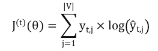

## 二、[GloVe及词向量的训练与评估](http://blog.showmeai.tech/cs224n/note02-GloVe-Training-and-Evaluation)

### 1.Glove

https://www.biaodianfu.com/glove.html#GloVe%E7%AE%80%E4%BB%8B

GloVe 由一个加权最小二乘模型组成，基于全局word-word 共现计数进行训练，从而有效地利用全局统计数据。

**如何从统计信息产生意义，以及产生的单词向量如何表示这些意义？**

Glove就是解决这个问题。

X表示word-word共现矩阵，其中$X_{ij}$表示词j 出现在词 i 的上下文的次数。令$X_i=\sum_{k}X_{ik}$为任意词 k 出现在词 i 的上下文的次数。

$P_{ij}=P(w_j|w_i)=\frac{X_{ij}}{X_i}$是词 j 出现在词 i 的上下文的概率。
$$
F(w_i,w_j,w_k)=\frac{P_{ik}}{P_{jk}}
$$
表示对于上下文词 k ，跟 i 的相似度 比上 跟 j 的相似度。

### 4.suggest reading

#### Improving DIstributianal Similarity with Lessons learned from Word Embeddings

**实际应用中如何获得更好的词向量**

虽然模型和优化的目标函数是主要因素，但是其他因素也会影响结果。

超参数优化：负采样的样本个数，平滑的负采样分布，动态大小的上下文窗口

一个经验法则：始终使用上下文分布平滑（cds=0.75）来修改PMI，并且适用于PPMI，SVD，和SGNS，不断提高性能。

#### Evaluation methods for unsupervised word embeddings

**无监督字嵌入的评估方法**

## 五、语言模型、RNN、GRU、LSTM2

### 1.Language Models

#### 1.1 Introduction

语言模型计算特定序列中多个单词出现的概率。
$$
P(w_1,...,w_m)=\prod_{i=1}^{i=m}P(w_i|w_1,...,w_{i-1})\approx\prod_{i=1}^{i=m}P(w_i|w_{i-n},...,w_{i-1})
$$
上式在语音识别和机器翻译中对判断一个词序列是否是一个输入句子的准确翻译i起到了重要的作用。

#### 1.2 n-gram Language Models

一般要加上拉普拉斯平滑操作，防止分子或者分母为0。   

一般 n<=5，n太大维度灾难。

#### 1.3 Window-based Neural Language Model (NNLM)

### 2.RNN（Recurrent Neural Networks）

传统的翻译模型只能以有限窗口大小的前n个单词作为条件进行语言模型建模，而循环神经网络能以语料库所有前面的单词作为条件进行语言模型建模。

其中，每一个时间步的参数使用相同的权重$W^{(hh)} 和 W^{(hx)}$。这样模型需要学习的参数变少了。

#### 2.1 RNN Loss and Perplexity

RNN中常用的损失函数是交叉熵误差。

在大小为T的语料库上的交叉熵误差的计算如下：

#### 2.2 Advantages ,Disadvantages, and Applications of RNNs

RNN优点：

1. 它可以处理任意长度的序列
2. 对更长的输入序列不会增加模型的参数大小
3. 对时间步t的理论可以利用前面很多时间步的信息
4. 权重不变，因此在处理输入时具有对称性。

缺点：

1. 计算速度很慢，依赖上一个时间步，所以不能优化

2. 实际中因为梯度消失和梯度爆炸，很难用到前面时间步的信息。

运行一层RNN所需的内存量与语料库里的单词数成正比。对于一个k个单词的句子在内存中会占用k个词向量的存储空间，同时，W和b也有可能很大，对于有1000个循环层的RNN，矩阵W的大小为1000 x 1000.

RNN可以应用到标注任务（词性标注、命名实体识别），句子分类（情感分类），编码模块（问答、机器翻译）。

#### 2.3 Vanishing Gradient & Gradient Explosion Problems 

梯度消失使得一个长文本在反向传播的过程中后面的梯度难以传到前面，所以在实际使用中无法预测长文本后面的单词。

#### 2.4 Solution to the Exploding & Vanishing Gradients

Mikolov 提出解决梯度爆炸的解决方法：每当梯度大于一个阈值的时候，将其截断为一个很小的值，

梯度消失的解决方法：1. 不去随机初始化$W^{(hh)}$，而是初始化为单位矩阵。

2. 使用RELU单元代替sigmoid函数。RELU的导数是0或者1，在反向传播的过程中不会出现梯度消失问题。

#### 2.5 Deep Bidirectional RNN

双向RNN：不仅从前往后预测，还从后往前预测。

