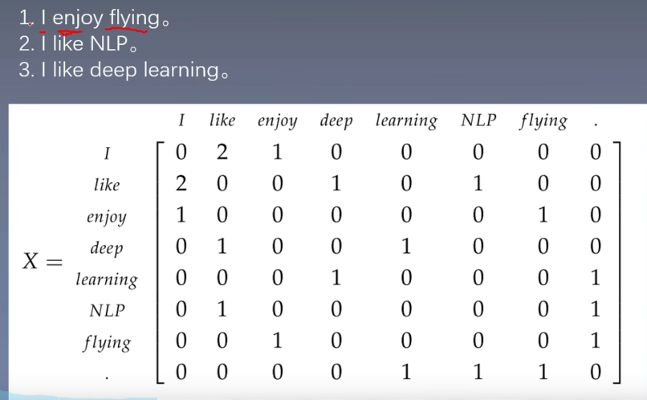
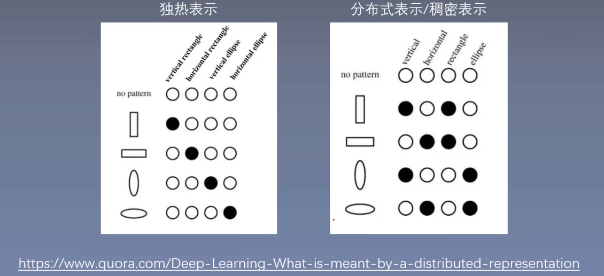
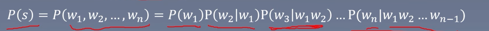
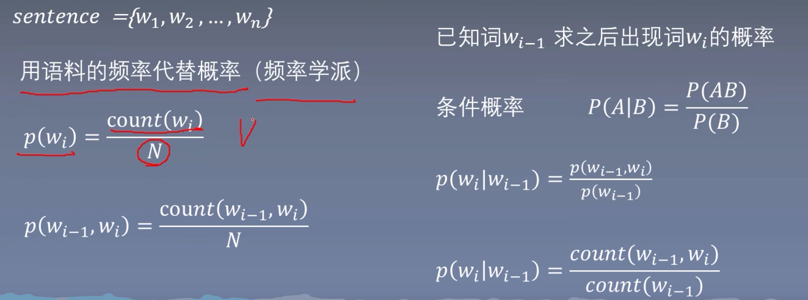

# 词向量

one-hot representation

缺点：词越多，维度越高；无法表示词与词之间关系。

window based Co-occurrence Matrix 基于窗口的共现矩阵

可通过SVD矩阵分解降维。

优点：可以一定程度上得到词与词之间的相似度。

缺点：矩阵太大，SVD分解效率低，可解释性差（分解后保留的k维数据代表什么？）。

distributed representation( 分布式表示)

word embedding( 词向量/词嵌入)

可以通过词与词之间的余弦相似度表示词与词之间的关系

1986年提出Distributed Representation-------2003年首次使用词向量-----------2013年 开源word2vec

### 研究意义

1. 衡量词向量之间的相似程度

`sim(word1,word2)=cos(wordvec1,wordvec2)`

2. 词类比analogy

`cos(word1 - word2 + word3,wordvec4)`

3. 作为预训练模型提升nlp任务

例如，命名实体识别、文本分类。将训练好的词向量作为其输入。

### 语言模型

概念：语言模型是计算一个句子是句子的概率的模型。

统计语言模型：通过概率计算来刻画语言模型。

统计语言模型中的平滑操作：Laplace Smoothing也称为加1平滑：每个词在原来出现次数的基础上加1

$$
P(s) = P(w_1,w_2,...,w_n) = P(w_1)P(w_2|w_1)P(w_3|w_1w_2)...
$$
