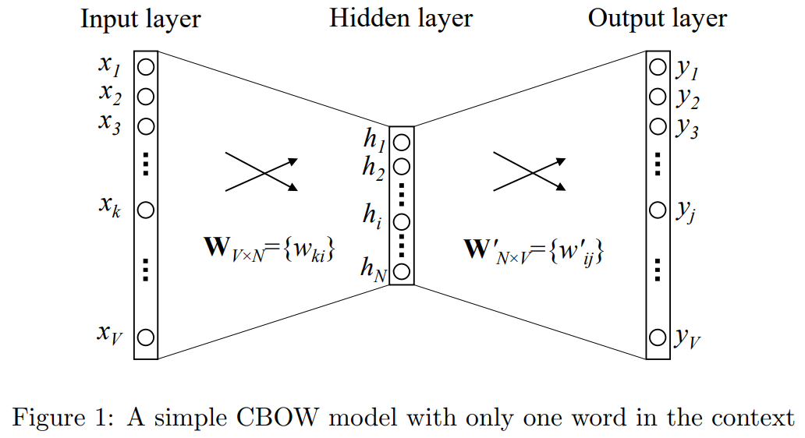
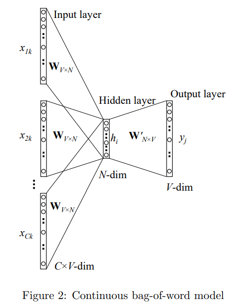
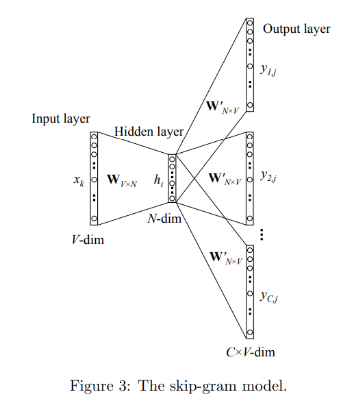
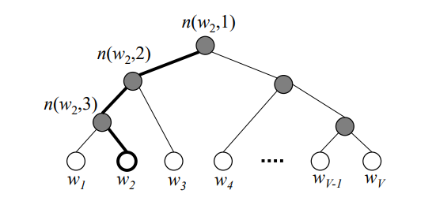
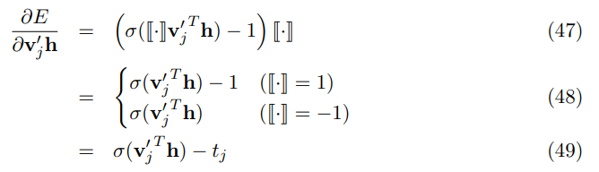
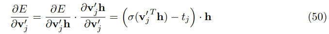
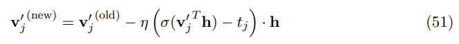
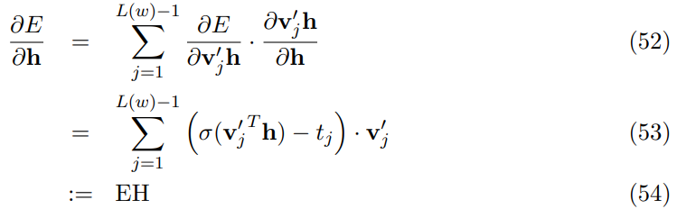
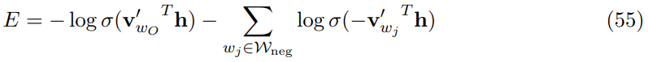

## 1. 连续词袋模型

### 1.1 one-word context（上下文一个词）

从词袋模型的最简单版本开始。我们假设每个上下文只考虑一个单词，这意味着给定模型一个上下文词去预测一个目标词，就像bigram模型。

图1显示了简化了上下文定义下的网络模型。规定，词汇量大小为V，隐含层大小为N。相邻层的单元是全连接的，输入是一个one-hot 向量，这意味着给的一个上下文单词，{${x_1,x_2 ... x_v}$}中只有一个1。

输入层和输出层之间的权重可以表示成一个V×N的矩阵W。W的每一行是一个N维的向量$V_W$。

通常，W的行$i$ 是$v_w^T$。给定一个上下文单词，设$x_k = 1$，则 
$$
h = W^Tx = W^T_{(k,.)}:=v_{w_I}^T               \quad (1)
$$
也就是将 W 的第 k 行复制到 h，$v_{w_I}$是输入单词$w_I$的向量表示。这暗示了隐含层的激活函数就是一个简单的线性函数。

从隐含层到输出层，有一个不同的权重矩阵，$W^‘={w_{ij}^‘}$，是一个$N × V$的矩阵。使用这些权重，我们可以为词汇表中每一个单词计算一个分数 $u_j$，
$$
u_j = v_{w_j}^{'T}h \quad (2)
$$
其中，$v_{w_j}^{'}$是$W^{'}$的第 j 列，即一个 $ N * 1$的矩阵。

然后可以使用softmax，一个对数线性分类模型，去得到词的后验分布，是一个多项分布。
$$
p(w_j|w_I) = y_j = \frac{exp(u_j)}{\sum_{j^{'}=1}^{V}exp(u_{j^{'}})} \quad(3)
$$
其中，$y_j$是输出层单元 j 的输出。把$(1) 和(2)$带入 $(3)$得到
$$
p(w_j|w_I) = \frac{exp(v_{w_j}^{'T}v_{w_I})}{\sum_{j^{'}=1}^{V}exp(v_{w_{j^{'}}}^{'}v_{w_I})}\quad(4)
$$
注意，$v_w$和$v_w^{'}$是单词$w$的两种表示形式。$v_w$来自W的行向量，是输入--隐含层的矩阵。而$v_w^{'}$来自$W^{'}$的列，是隐含层--输出层的矩阵。在随后的分析中，称$v_w$为“输出向量”，而$v_w^{'}$为“输出向量”，它们都是单词 $w$的向量。

**更新隐含层---》输出层权重的方程**

训练目标是最大化 （4）式，即最大化给定上下文单词 $w_I$下输出一个正确的输出 $w_O$的条件概率。
$$
maxp(w_O|w_I)=maxy_j*\quad(5)\\=maxlogy_j*\quad(6)\\=u_j*-log\sum_{j^{'}=1}^{V}exp(u_{j^{'}}):=-E\quad(7)
$$
其中，$E=-logp(w_O|w_I)$是我们的代价函数（我们想要最小化E），$j*$是输出层实际输出的索引。注意：这个损失函数可以理解为两个概率分布之间的交叉熵测量的特殊情况。

下面推导隐含层和输出层之间的权重更新公式。
$$
\frac{\partial E}{\partial u_j}=y_j-t_j:=e_j\quad(8)
$$
$t_j=1$只在第 j 单元是实际输出单词，否则为0. 注意，这个导数就是输出层的预测误差ej。

接下来对$w_{ij}^{'}$求导获得隐含层---》输出层权重的梯度。
$$
\frac{\partial E}{\partial w_{ij}^{'}}=\frac{\partial E}{\partial u_j}*\frac{\partial u_j}{\partial w_{ij}^{'}}=e_j*h_i\quad(9)
$$
因此，使用随机梯度下降，我们得到隐含层--》输出层的权重更新方程为
$$
w_{ij}^{'(new)}=w_{ij}^{'(old)}-\eta*e_j*h_j\quad(10)
$$
或者
$$
v_{w_j}^{'(new)}=v_{w_j}^{'(old)}-\eta*e_j*h\quad for j=1,2,...,V.\quad(11)
$$
其中，$\eta$是学习率，$e_j = y_j-t_j$，$h_i$是隐含层的第 i 个单元；$v_{w_j}^{'}$是输出向量$w_j$。

注意，这个更新方程意味着我们必须遍查词汇表中每一个可能的单词，检查其输出概率$y_j$，并与它的预期输出$t_j$进行比较(要么0，要么1)。如果 $y_j>t_j$，就减少隐含向量h的一部分，让$v_{w_j}^{'}$距离$v_{w_I}$更远；如果 $y_j<t_j$，就增加h的一部分，让$v_{w_j}^{'}$距离$v_{w_I}$更近；如果yj非常接近tj，那么根据更新方程，权值变化很小。

**更新输入--》隐含层的权重的方程**

用E对隐含层的输出求偏导
$$
\frac{\partial E}{\partial h_i}=\sum_{j=1}^{V}\frac{\partial E}{\partial u_j}*\frac{\partial u_j}{\partial h_i}=\sum_{j=1}^{V}e_j*w_{ij}^{'}:=EH_i\quad(12)
$$
其中，$h_i$是隐含层的第 i 个单元的输出；$u_j$在（2）中被定义，输出层的第j个单元的净输入；

$e_j=y_j-t_j$是输出层的第j个单词的预测误差。EH，一个N维的向量，是词汇表中所有单词的输出向量之和，并以他们的预测误差加权。

接下来要对W求导。展开（1）式可得
$$
h_i=\sum_{k=1}^{V}x_k*w_{ki}\quad(13)
$$
现在可以对W的每一个元素求导，
$$
\frac{\partial E}{\partial w_{ki}}=\frac{\partial E}{\partial h_i}*\frac{\partial h_i}{\partial w_{ki}}=EH_i*x_k\quad(14)
$$
这等价于x和EH的张量积，
$$
\frac{\partial E}{\partial W}=x \otimes EH=xEH^T\quad(15)
$$
从而得到一个 $V * N$的矩阵，因为x只有一个分量是非0 的，$\frac{\partial E}{\partial W}$只有一行是非0 的，并且那一行的值为$EH^T$，一个N维的向量。我们得到W的更新公式为，
$$
v_{w_I}^{new}=v_{w_I}^{old}-\eta EH^T\quad(16)
$$
其中，$v_{w_I}$是W的一行，是唯一上下文单词的“输入向量”，并且是W中唯一导数非零的行。在这个迭代之后，W的所有其他行将保持不变，因为它们的导数为零。

直观地说，由于向量EH是词汇表中所有单词的输出向量之和，其预测误差$e_j=y_j-t_j$，因此我们可以将 (16) 理解为将词汇表中每个输出向量的一部分加到上下文单词的输入向量上。如果在输出层，一个词$w_j$作为输出词的概率被高估($y_j > t_j$)，那么上下文词$w_I$的输入向量将趋向于远离$w_j$的输出向量;相反，如果$w_j$是输出字的概率被低估($y_j < t_j$)，则输入向量$w_I$将趋向于向输出向量$w_j$靠拢;

### 1.2 多词上下文

图2显示了具有多词上下文的CBOW模型。在计算隐层输出时，CBOW模型没有直接复制输入上下文词的输入向量，而是取输入上下文词的向量的平均值，并且使用输入层--》隐含层权重矩阵和平均向量的乘积作为输出。
$$
h = \frac{1}{C}W^T(x_1,x_2,...,x_C) \quad(17)\\= \frac{1}{C}(v_{w_1}+v_{w_2}+...+v_{w_C})^T\quad(18)
$$
C是上下文中的单词数，w1, · · · , wC是上下文中的单词数，$v_w$是单词w的输入向量。

损失函数为：
$$
E =-logp(w_O|w_{I,1},...,w_{I,C})\quad(19)\\=-u_{j^*}+log\sum_{j^{'}}^{V}exp(u_{j^{'}})\quad(20)\\=-v_{w_O}^{'T}*h+log\sum_{j^{'}}^{V}exp(v_{w_j}^{'T}*h)\quad(21)
$$
上式和（7）式一样，单词上下文模型的目标函数，除了 在（18）和（1）中定义的**h** 不一样。

隐含层--》输出层的更新方程与单子上下文模型的（11）一样。
$$
v_{w_j}^{'(new)}=v_{w_j}^{'(old)}-\eta*e_j*h\quad for j=1,2,...,V.\quad(22)
$$
注意，我们需要将此应用于每个训练实例的hidden→output权重矩阵的每个元素。

输入→隐藏权重的更新方程类似于 (16) ，不同的是，现在我们需要对上下文中的每个单词$w_{I,C}$应用以下方程:
$$
v_{w_{I,c}}^{new}=v_{w_{I,c}}^{old}-\frac{1}{C}\eta EH^T\quad for c=1,2,...,C.\quad(23)
$$
$v_{w_{I,c}}$是输入上下文中第 c 个单词的输入向量；$\eta$是一个正的学习率；$EH=\frac{\partial E}{\partial h_i}$从（12）中得出。这个更新方程的直观理解与（16）一样。

## 2.Skip-Gram Model

仍然用$v_{w_I}$代表输入层的唯一单词，所以对于隐含层的输出 **h** 有跟（1）相同的定义，即 **h**就是复制了输入--》隐含层的权重矩阵 **W** 的一行。
$$
h = W^T_{(k,.)}:=v_{w_I}^T               \quad (24)
$$
在输出层，输出 **C**个多项分布。每一个输出使用同一个隐含层--》输出层的权重矩阵。
$$
p(w_{c,j}=w_{O,c}|w_I)=y_{c,j}=\frac{exp(u_{c,j})}{\sum_{j^{'}=1}^{V}exp(u_{j^{'}})}\quad(25)
$$
其中，$w_{c,j}$是第 j 个单词在第 c 个输出中。$w_{c,j}$是实际应该第c 个输出的词。$y_{c,j}$是第 c 个输出的 第 j 位。

$u_{c,j}$是净输入，因为共享权重，所以
$$
u_{c,j} =u_j= v_{w_j}^{'T}h \quad for c=1,2,...,C.\quad (26)
$$
其中，$v_{w_j}^{'}$是词汇表中第 j 个单词$w_j$的输出向量，也是隐含层--》输出层权重矩阵$W^{'}$的一列。

参数方程的推导与单词上下文模型没有太大的区别。
$$
E=-logp(w_{O,1},w_{O,2},...w_{O,c}|w_I)\quad(27)\\=-log\prod_{c=1}^{C}\frac{exp(u_{c,j_c^*})}{\sum_{j^{'}=1}^{V}exp(u_{j^{'}})}\quad(28)\\=-\sum_{c=1}^{C}u_{j_c^*}+C*log\sum_{j^{'}=1}^{V}exp(u_{j^{'}})\quad (29)
$$
其中，$j_c^*$是实际输出的第c个上下文单词。

对 输出层的输入求偏导得到
$$
\frac{\partial E}{\partial u_{c,j}}=y_{c,j}-t_{c,j}:=e_{c,j}\quad (30)
$$
即单元上的预测误差，与（8）相同。为了简单，定义 V 维的向量 $EI=\{{EI_1,...,EI_V}\}$作为所有误差的和
$$
EI_j=\sum_{c=1}^{C}e_{c,j}\quad (31)
$$
对隐含层--》输出层的权重$W^{'}$求导得到
$$
\frac{\partial E}{\partial w_{ij}^{'}}=\sum_{c=1}^{C}\frac{\partial E}{\partial u_{c,j}}*\frac{\partial u_{c,j}}{\partial w_{ij}^{'}}=EI_j*h_i\quad(32)
$$
然后获得隐含层--》输出层的权重的更新方程：
$$
w_{ij}^{'(new)}=w_{ij}^{'(old)}-\eta*EI_j*h_i\quad(33)
$$
或者
$$
v_{w_j}^{'(new)}=v_{w_j}^{'(old)}-\eta*EI_j*h\quad for j=1,2,...,V.\quad(34)
$$
输入层--》隐含层的更新方程与（12）到（16）完全相同，除了预测误差 $e_j$ 被 $EI_j$替代。直接给出更新公式
$$
v_{w_I}^{new}=v_{w_I}^{old}-\eta EH^T\quad(35)
$$
EH是一个N维的向量，每个元素被定义为
$$
EH_i=\sum_{j=1}^{V}EI_j*w_{ij}^{'}\quad (36)
$$

## 3.优化计算效率

对于所有模型，每个单词都有两个向量表示：输入向量$v_w$和输出向量$v_w^{'}$。学习输入向量比较快，但是学习输出向量很费时，从更新方程（22）和（33）可以看出，为了更新$v_w^{'}$，对于训练的每一次，我们需要遍历每一个单词$w_j$，计算它们的网络输入$u_j$，概率预测值$y_j$（或者$y_{c,j}$对于skip-gram），它们的预测误差$e_j$（或者$EI_J$对于skip-gram），最后用预测误差去更新他们的输出向量$v_j^{'}$。

​	对每个培训实例的所有词汇进行这样的计算是非常昂贵的，因此不可能扩大到广泛的词汇或广泛的培训语料库。为了解决这个问题，直觉是限制每个培训实例必须更新的输出向量的数量。实现这一目标的一个优雅方法是分层softmax;另一种方法是抽样，这将在下一节讨论。

​	这两种技巧都只优化输出向量更新的计算。在我们的推导中，我们关注三个值:（1）E，新的损失函数；（2）$\frac{\partial E}{\partial v_w^{'}}$，新的对于输出向量的更新方程；（3）$\frac{\partial E}{\partial h}$，为更新输入向量而反向传播的预测误差的加权和。

### 3.1 分层softmax（少）

分层softmax中，白色叶节点代表词汇表中的每个词，黑色是内部节点。图中高亮路径是root到$w_2$的路径，长度为4，$n(w,j)$表示从root到单词 w 的路径上的第 j 个节点。

在层次softmax模型中，单词没有输出向量表示。而每个内部节点（V-1个）有一个输出向量$v_{n(w,j)}^{'}$。

输出的概率为：
$$
p(w=w_O)=\prod_{j=1}^{L(w)-1}\sigma([n(w,j+1)=ch(n(w,j))]*v_{n(w,j)}^{'T}h)\quad (37)
$$
其中，$ch(n)$是n节点的左孩子；$v_{n(w,j)}^{'}$是内部节点$n(w,j)$的向量表示（“输出向量”）；h是隐含层的输出值（在skip-gram模型中$h=v_{w_I}$；在CBOW中，$h=\frac{1}{C}\sum_{c=1}^{C}v_{w_c}$）；$[x]$是一个特殊的函数定义为：
$$
[x]=\begin{cases}1 & \mbox{if x is true} \\-1 & \mbox{otherwise}
\end{cases} \quad(38)
$$
通过一个例子直观理解这个等式。看图4，假设我们计算$w_2$是输出单词的概率，我们将这个概率定义为从根节点开始的叶节点结束的随机游走的概率。在每一个内部节点，我们需要分配向左或者向右走的概率。我们定义在节点n向左走的概率为
$$
p(n,left)=\sigma(v_n^{'T}*h) \quad (39)
$$
这个式子由内部节点的向量表示和隐含层的输出值（随后由输入单词的向量表示决定）决定。显然向右走的概率为
$$
p(n,right)=1-\sigma(v_n^{'T}*h)=\sigma(-v_n^{'T}*h)\quad(40)
$$
在图4 中从根节点到$w_2$的路径，我们可以计算$w_2$成为输出单词的概率为：
$$
p(w_2=W_O)=p(n(w_2,1),left)*p(n(w_2),left)*P(n(w_2,3),right) &(41)\\=\sigma(v_{n(w_2,1)}^{'T}*h)*\sigma(v_{n(w_2,2)}^{'T}*h)*\sigma(-v_{n(w_2,3)}^{'T}*h) & (42)
$$
这就是式子（37）。不难验证，
$$
\sum_{i=1}^{V}p(w_i=w_O)=1\quad(43)
$$
使得分层softmax成为一个所有单词的一个多项分布。

现在推导出内部节点的向量表示的参数更新方程。为了简单，先看单字上下文模型。

为了简化，定义下式：
$$
[\centerdot]:=[n(w,j+1)=ch(n(w,j))]&(44)\\v_j^{'}:=v_{n_{w,j}}^{'}&(45)
$$
在一次训练中，损失函数被定义为
$$
E=-logp(w=w_O|w_I)=-\sum_{j=1}^{L(w)-1}log\sigma([\centerdot]v_j^{'T}h)\quad(46)
$$
计算关于$v_j^{'}h$的导数

当$[\centerdot]=1$时，$t_{j}=1$，否则 $t_{j}=0$。

然后我们取E的导数与内单位n(w, j)的向量表示有关，得到

得到更新方程：

赏识应用于 $j=1,2,...,L(w)-1$。我们认为 $\sigma(v_j^{'T})-t_j$是内部节点 n（w,j）的预测误差。每一个内部节点的任务是预测往右孩子还是左孩子走。$t_{j}=1$意味着真实值是走左孩子；$t_{j}=0$是真实值走右孩子。$\sigma(v_j^{'T})$是预测结果。对于一个训练实例，如果内部单位的预测非常接近地面真理，它的向量表示$v_{j}^{'}$会移动得很小；否则$v_{j}^{'}$会移动将通过移动(离h更近或更远5)以适当的方向移动，以减少本实例的预测误差。这个更新方程可以用于CBOW和skip-gram 模型。当用于skip-gram模型时，我们需要对输出上下文C中的每个字重复此更新过程。

为了反向传播学习输入→隐藏权重的错误，我们取E的导数与隐藏层的输出，得到

上式可以直接替换到（23）中，去获得CBOW的更新公式。对于skip-gram模型，我们需要为每个词计算一个EH值在 skip-gram 上下文中，将 EH 值的总和代入 (35) 以获得更新输入向量的方程。

从更新方程中，我们可以看到每次训练的计算复杂度每个上下文词的实例从 O(V ) 减少到 O(log(V ))，这是一个很大的改进在速度。 我们仍然有大致相同数量的参数（内部单元的 V -1 个向量与最初的 V 个单词输出向量相比）。

### 负采样（更好）

：：

负采样比softmax更直接，由于每次要更新的输出向量太多，只更新其中一部分。

显然输出词应保留在样本中更新，还需要几个词作为负面的例子。抽样过程需要一个概率分布，可以任意选择。我们称这种分布为噪声分布，表示为Pn(w)。一个人可以从经验上确定一个好的分布。

在word2vec中，作者认为以下简化的培训目标能够产生高质量的文字嵌入，而不是使用一种形式的负抽样来产生定义良好的后多项分布。

其中wO是输出词(即积极样本)和$v_{w_O}^{'}$是它的输出向量；h是隐藏层的输出值：
