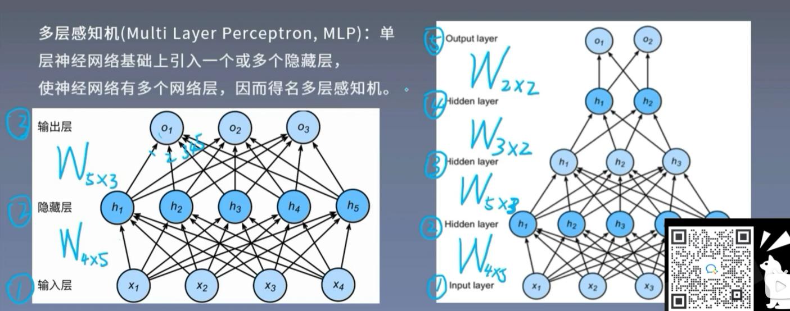
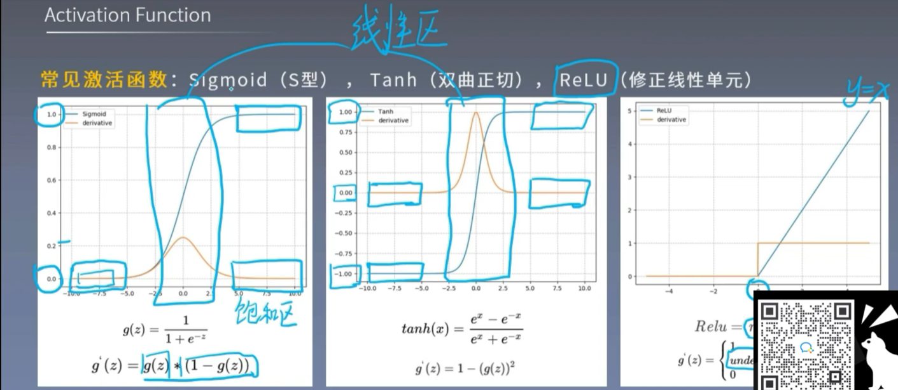
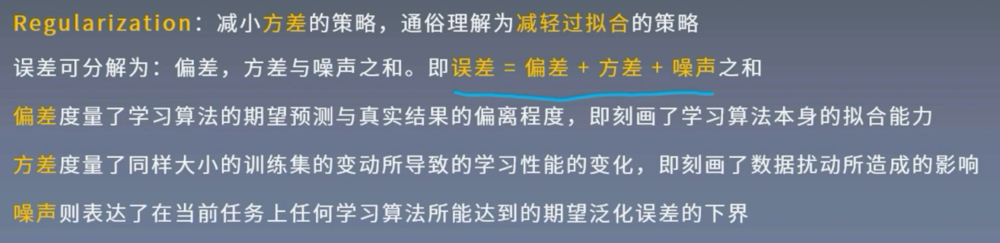

### 1.感知机

无法解决异或问题。

### 2.多层感知机

必须加激活函数，否则会退化成单层网络。

激活函数：1. 让多层感知机成为真正的多层

2. 引入非线性，使网络可以逼近任意非线性函数。（万能逼近定理）

激活函数需要以下几点性质：

1. 连续并可导。便于利用数值优化的方法来学习网络参数。
2. 激活函数及其导函数要尽可能的简单，有利于提高网络计算效率。
3. 激活函数的导函数的值域要在合适区间内。（反向传播）

### 3.反向传播

作用：用于权重更新，使网络输出更接近标签.

反向传播原理：链式求导法则。
$$
y = f(u),u = g(x), \frac{\partial y}{\partial x} = \frac{\partial y}{\partial u}\frac{\partial u}{\partial x}
$$
### 损失函数

损失函数（Loss Funtion）：对单个样本
$$
Loss = f(\hat{y},y)
$$
代价函数（Cost Funtion）：对总体
$$
Cost = 	\frac{1}{N}\sum_{i}^{N}f(\hat{y},y)
$$
目标函数（objective Funtion）:
$$
Obj = Cost + Regularization Term
$$
两种常见损失函数：

1. MSE（均方误差，Mean Squared Error）:常用于回归任务

$$
MSE = 	\frac{\sum_{i=1}^{N}(y_i-y_i^p)^2}{n}
$$

2. CE（Cross entropy，交叉熵）

用于衡量两个分布的差异，常在分类任务中使用。
$$
H(p,q) = -\sum_{i=1}^{n}p(x_i)logq(x_i)
$$
信息熵：描述信息的不确定性。所有可能取值的信息量的期望。
$$
H(x) = -E[logP(x)] = -\sum_{i=1}^{N}p_ilog(p_i)
$$
相对熵：又称为 K-L 散度，衡量两个分布之间的差异。
$$
D_{KL}(P||Q) = \sum_{i=1}^{N}P(x_i)(logP(x_i)-logQ(x_i))
$$
可见，交叉熵 = 信息熵 + 相对熵 。

结论：优化交叉熵等于优化相对熵。

softmax 函数：将数据变换到符合概率分布的形式。
$$
y_i = S(z)_i =\frac{e^{z_i}}{\sum_{j=1}^{C}e^{z_i}}
$$
将原本的 **输出** 先求指数（**实现非负**），然后除以指数之和（**实现概率之和为1**）。

### 权值初始化

高斯分布随机初始化，从高斯分布中随机采样，对权重进行赋值，比如 N ~ (0,0.01)。

3σ准则： 数值分布在 （μ-3σ，μ+3σ）中的概率为 99.73%。

自适应标准差：Xavier 初始化： 《Understanding the difficulty of training deep feedforward neural networks》

Kaiming 初始化：《Delving Deep into Rectifiers : Surpassing Human-......》

### 正则化方法

