## 3.特征工程

### 3.1重要性

就是从原始数据提取特征的过程，一般包括特征使用、特征获取、特征处理、特征选择和特征监控。

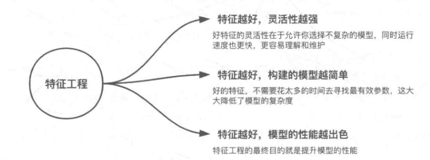

### 3.2数据预处理和特征处理

#### 3.2.1数据预处理

特征提取之前，要对数据进行预处理，具体包括数据采集、数据清洗、数据采样

**1.数据采集**	

采集对预测结果有帮助的数据

**2.数据清洗	**	

去除不可信的“脏”数据，例如：身高3米的人

**3.数据采样**

数据在采集、清洗过后正负样本不均衡，故要数据采样。方法有随机采样和分层抽样。随机采样的缺点是，可能某次采集到的数据很不均匀，因此更多的是根据特征进行分层抽样。

正负样本不均衡的处理：

正 > 负 ， 且量大， 采用*下采样*（downsampling）的方法。

正 > 负  ， 且量不大， 采用*上采样* (oversampling)。例如图像识别中的镜像和旋转；修改损失函数、设置样本权重。

#### 3.2.2特征处理

特征处理的方法包括标准化、区间放缩法、归一化、定量特征二值化、定性特征哑编码、缺失值处理、数据转换。

**1.标准化	**	

即特征向量转化为标准化向量，使服从标准正太分布。

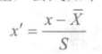

例如，使用preprocessing库的StandardScaler类对iris数据集进行标准化，

```python
from sklearn.preprocessing import StanardScaler
from sklearn.datasets import load_iris
iris = load_iris()
#标准化，返回值为标准化后的数据
StandardScaler().fit_transform(iris.data)
```

**2.区间缩放	**		

常用最值，

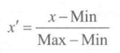

例如，使用preprocessing库的MinMaxScaler类对iris数据集进行区间缩放，

```python
from sklearn.preprocessing import MinMaxScaler
#缩放到[0，1]区间
MinMaxScaler().fit_transform(iris.data)
```

**3.归一化	**	

归一化会改变数据的原始距离、分布和信息，但标准化不会。

规则为L2的归一化公式如下：

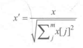

例如，使用preprocessing 库的 Normalizer 类对 iris数据集进行归一化

```python
from sklearn.preprocessing import Normalizer

Normalizer().fit_transform(iris.data)
```

归一化和标准化使用场景：

- 对输出结果范围有要求或数据较为稳定，则用归一化。
- 数据存在较多异常值和噪声，则用标准化。
- 支持向量机、k近邻、主成分分析等模型必须进行归一化或者标准化操作

**4.定量特征二值化	**	

关键在于设定阈值，

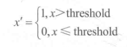

例如，使用preprocessing 库的 Binarizer 类对 iris数据集进行二值化，

```python
from sklearn.preprocessing import Binarizer

Binarizer(threshold=3).fit_transform(iris.data)
```

**5.定性特征哑编码	**	

将不能定量处理的特征进行量化，

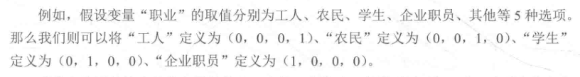

例如，使用preprocessing 库的 OneHotEncoder  类对 iris数据集的目标变量进行哑编码，

```python
from sklearn.preprocessing import OneHotEncoder

OneHotEncoder(categories='auto').fit_transform(iris.target.reshape((-1,1)))
```

**6.缺失值处理	**	

数据为NaN，可以使用impute 库的 SimpleImputer 类处理缺失值，

```python
from numpy import vstack ,array, nan
from sklearn.impute import SimpleImputer

SimpleImputer().fit_transform(vstack((array[nan,nan,nan,nan]),iris.data))
```

**7.数据转换	**	

1）多项式转换

4个特征，度为2的多项式转换公式为：

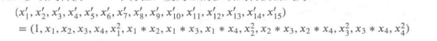

```python
from sklearn.preprocessing import PolynomialFeatures

PolynomialFeatures().fit_transform(iris.data)
```

2)对数变换

```python
from sklearn.preprocessing import FunctionTransformer
from numpy import loglp

FuntionTransformer(loglp, validate=False).fit_transform(iris.data)
```

**8.小结	**	

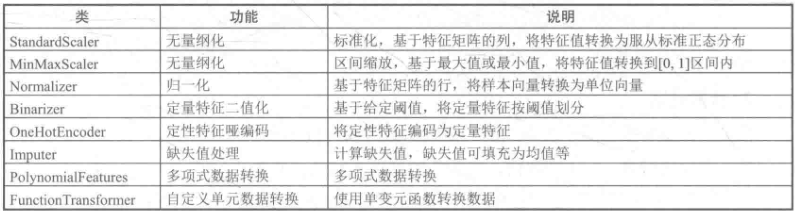

### 3.3 特征降维

高维 ------》 低维

常用方法有特征选择和线性降维。

#### 3.3.1 特征选择

**1.定义	**	

删除不需要的特征。特征选择的目标如图所示：

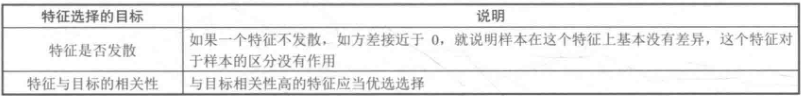

**2.特征选择的方法	**	

- 过滤法：按照发散性或者相关性对各个特征评分，通过设定阈值来选择特征。
- 包装法：根据目标函数每次选择若干特征。
- 嵌入法：使用机器学习的某些算法和模型进行训练，得到各个特征的权值系数，根据系数大小选择特征。

优缺点如下：

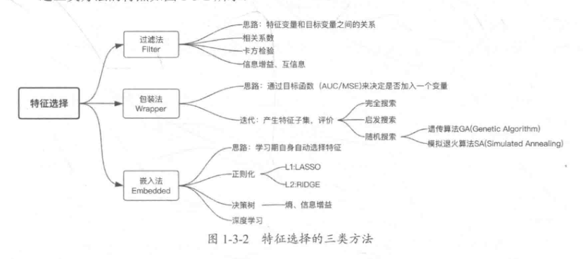

**3.特征选择在python中的具体实现	**	

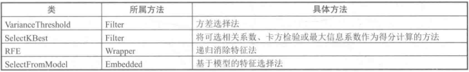

1）VariceThreshold

使用方差选择法，先计算各个特征的方差，然后根据阈值选择方差大于阈值的特征。

用 teature_selection 库的VarienceThreshold 类来选择特征， 以 iris数据集为例

```python
from sklearn.feature_selection import VarianceThreshold
from sklearn.datasets import load_iris
iris = load_iris()
VarianceThreshold(threshold=3).fit_transform(iris.data)
```

2)SelectBest

1.相关系数法。计算各个特征对目标值的相关系数和相关系数的P值，然后根据阈值来筛选特征。

```python
from sklearn.feature_selection import SelectKBest
from numpy import np
import array
from sklearn.datasets import load_iris
from scipy.stats import pearsonr
iris = load_iris()
SelectKBest(
 lambda X,Y:np.array(list(map(lambda x:pearsonr(x,Y),X,T))).T[0],
 k=2).fit_transform(iris.data,iris.target)
```

2.卡方检验。

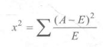

```python
from sklearn.datasets import load_iris
from sklearn.feature_selection import SelectKBest
from sklearn.feature_selection import chi2
iris = load_iris()
SelectKBest(chi2,k=2).fit_transform(iris.data,iris.target)
```

3.最大信息系数法。

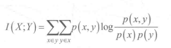

```python
from sklearn.feature_selection import SelectKBest
import numpy as np
from minepy import MINE

def mic(x, y):
	m = MINE()
	m.compute_score(x,y)
	return (m.mic(),0.5)
	
SelectKBest(
 lambda X,Y:np.array(list(map(lambda x:mic(x,Y),X,T))).T[0],
 k=2).fit_transform(iris.data,iris.target)
```

3)RFE

递归消除特征法使用一个基模型来进行多轮训练，每轮后，消除若干权值系数的特征，再基于新的特征集进行下一轮训练。

```python
from sklearn.feature_selection import RFE
from sklearn.linear_model import LogisticRegression

RFE(estimator=LogisticRegression(multi_class='auto',solver='lbfgs',max_iter=500),n_features_to_select=2).fit_transform(iris.data,iris.target)
```

4)SelectFromModel

SelectFromModel主要采用基于模型的特征选择法，常见有基于树模型和惩罚项的特征选择法。

1.基于惩罚项的特征选择法使用带惩罚项的基模型。除了能筛选出特征，也进行了降维。

使用feature_selection 库的SelectFromModel 类结合带L1惩罚项的逻辑回归模型来选择特征

```python
from sklearn.feature_selection import SelectFromModel
from sklearn.linear_model import LogisticRegression

SelectFromModel(LogisticRegression(penalty='12',C=0.1,solver='lbfgs',multi_class='auto')).fit_transform(iris.data,iris.target)
```

2.基于树模型的特征选择法。

使用feature_selection 库的SelectFromModel 结合GBDT模型选择特征

```python
from sklearn.feature_selection import SelectFromModel
from sklearn.linear_model import GradientBoostingClassifier

SelectFromModel(GradientBoostingClassifier()).fit_transform(iris.data,iris.target)
```

#### 3.3.2 线性降维

**1.主成分分析法**

通过某种线性投影，将高维的数据映射到低维的空间中表示，并期望在所投影的维度上数据的方差最大，以此达到使用较少的数据维度来保留较多的原数据点特性的效果。

```python
from sklearn.decomposition import PCA
PCA(n_components=2).fit_transform(iris.data)
```

**2. 线性判别分析法**

有监督的线性降维算法，使降维后的数据尽可能地容易被区分，其利用了标签的信息。

假设原始数据为X，我们希望找到映射向量a，使得aX后的数据点能够保持以下两种性质：1.同类数据尽可能接近2.不同类数据点尽可能分开。

```python
from sklearn.discriminant_analysis import LinearDiscriminantAnalysis as LDA

LDA(n_components=2).fit_transform(iris.data, iris.target)
```


### 3.4 赛题特征工程

## 4.模型训练

### 4.1 回归及相关模型

#### 4.1.1 回归的概念

目标数量连续时预测目标数量的值。

#### 4.1.2 回归模型训练和预测

1. 导入工具库。
2. 对数据预处理，具体为缺失值处理、连续特征归一化、类别特征转换。
3. 训练模型。
4. 预测结果。

#### 4.1.3 线性回归模型

**1.一元线性回归**

使用单一特征来预测响应值，通过最小化预测值与真实值之间的误差得到。

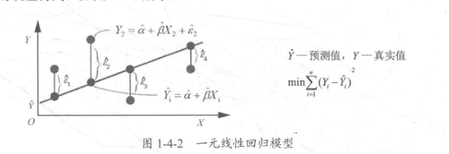

**2.多元线性回归	**

使用多个特征的线性函数作为模型。

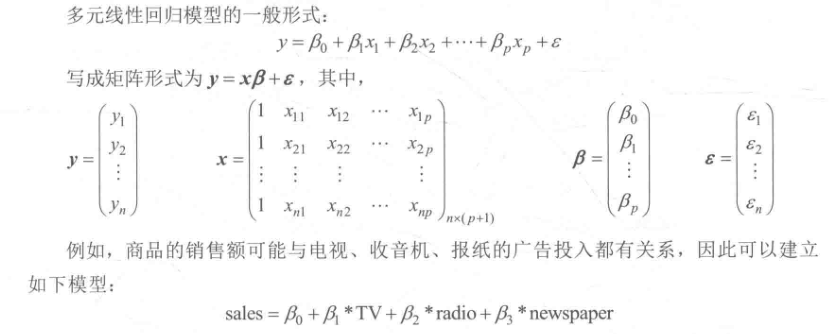

**3. 线性回归调用方法**

在特征工程之后，需要对数据集进行切分。

```python
from sklearn.model_selection import train_test_split
new_train_pca_16=new_train_pca_16.fillna(0)
train=new_train_pca_16[new_test_pca_16.columns]
target = new_train_pca_16['target']

train_data,test_data,train_target,test_target=train_test_split(
	train,target,test_size=0.2,random_state=0)
```

使用sklearn调用线性回归模型进行预测，

```python
from sklearn.metrics import mean_squared_error

from sklearn.linear_model import LinearRegression
clf=LinearRegression()
clf.fit(train_data,train_target)
test_pred=clf.predict(test_data)
score=mean_squared_error(test_target,test_pred)
print("LinearRegression:",score)

```


#### 4.1.4 k近邻回归模型

**1.介绍	**

可用于回归和分类。

通过找出某个样本k个最近邻居，将这些邻居的某个属性的平均值赋给该样本，就可以得到该样本对应的属性的值。

**2. 调用方法	**

```python
from sklearn.neighbors import KNeighborsRegressor

clf.KNeighborsRegressor(n_neighbors=3)
clf.fit(train_data,train_target)
test_pred = clf.predict(test_data)
score = mean_squared_error(test_target,clf.predict(test_data))
print("",score)
```


#### 4.1.5 决策树回归模型

**1. 介绍**

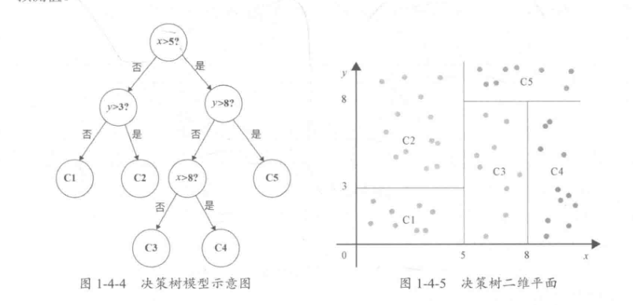


**2. 决策树回归举例	**

数据如表所示，

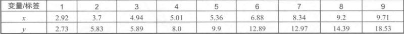

由于特征为一维数据，因此可以考虑将分割点放在两点的中间。为了简化，这里将分割点定为x两点中较小的点。8个分割点为{2.92、3.7、4.94、5.01、5.36、6.88、8.34、9.2}。

1. 选择最优分割点D，记为第k大的数。 损失函数为，

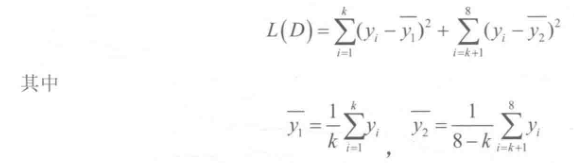

2. 计算根据分割点D划分的子区域损失值。

当k=1时，即分割点为2.92时，

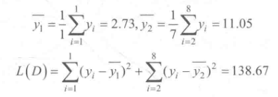

遍历所有分割点，计算L(D)。

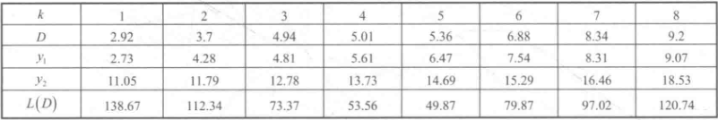

可以发现，当分割点D取5.36，即k取5时，L最小，此时y1和y2分别为6.47和14.69，划分的样本D左为{2.92、3.7、4.94、5.01、5.36}，D右为{6.88、8.34、9.2、9.71}。

3. 接着对D左右继续上述步骤。

对于左，

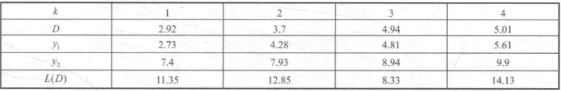

取分割点4.94，     对于右，

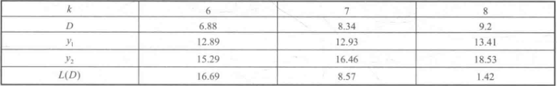

取分割点9.2。

4. 生成决策树。

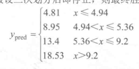

**3. 决策树调用方法**

```python
from sklearn.tree import DecisionTreeRegressor

clf=DecisionTreeRegressor()
clf.fit(train_data,train_target)
test_pred=clf.predict(test_data)
score=mean_squared_error(test_target,test_pred)
```

#### 4.1.6 集成学习回归模型

**1. 随机森林回归模型	**

基本单元是决策树，输出所有决策树输出的平均值。

主要优点：

- 准确。对缺省值问题也能够获得好的结果。
- 对大数据集友好
- 能处理高维，不需要降维
- 能够评估各个特征在分类问题上的重要性
- 在生成过程中，能够获取到内部生成误差的一中无偏估计。

```python
from sklearn.ensemble import randomForestRegressor

clf=RandomForestRegressor(n_estimators=200)#200棵树模型
clf.fit(train_data,train_target)
test_pred=clf.predict(test_data)
score=mean_squared_error(test_target,test_pred)
```

**2.LightGBM回归模型**

LightGBM是微软开发的一个GBDT算法框架，支持高效率的并行训练，具有更快的速度、更低的内存消耗、更好的准确率、分布式支持、可以快速处理海量数据等特征。

原项目在GitHub。

改进：

1. 把连续的浮点值离散化为k个整数，同时构造一个宽度为k的直方图，如图所示。在遍历数据时，将离散化后的值作为索引在直方图中累计统计量。当遍历一次数据后，直方图也积累了需要的统计量，在根据直方图的离散值遍历寻找最优的分割点。

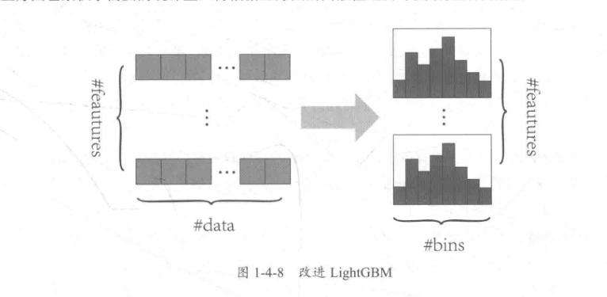

2. 减小内存占用，比如在离散为256个bin时，只需要8bit。
3. 减少在 split finding 计算增益时的计算量，从O(#data) 降到 O(#bins)。
4. 直方图做差加速。

a）一个叶子节点的直方图可以由其父节点的直方图与兄弟节点的直方图做差得到，以提升速度。

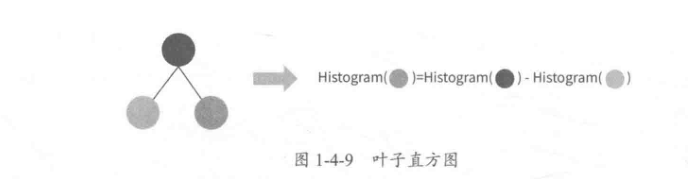

b）构造直方图通常需要遍历该叶子上的所有数据，而直方图做差仅需遍历直方图的K个桶，利用这个方法在 LightGBM 中构造一个叶子直方图后，可以用非常微小的代价得到其他兄弟叶子的直方图，速度上可提升一倍。

5. 建树过程的两种方法是 Level-wise 和 leaf-wise ，如图所示，

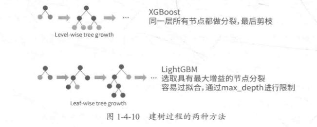

6. 并行学习的优化。

a）特征并行。传统特征并行具有以下特点：垂直切分数据，每个 worker 只有部分特征，如图所示。每个worker 在找到局部最佳分割点之后进行节点间的相互通信找到全局最佳分割点，然后在全局最佳分割特征的 worker 上进行节点分裂，最后对得到的左右子树的实例节点进行广播，其他的节点根据广播的实例继续进行节点分裂。

特征并行在 split finding 过程中会存在计算复杂度过高的问题，当数据量大的时候会比较慢。

LightGBM 的特征并行具有以下特点：每个worker 保存所有的数据集；每个worker 在其特征子集上寻找最佳分割点；worker 之间互相通信，找到全局最佳分割点；每个worker 根据全局最佳分割点进行节点分裂。

LightGBM 的优点是避免广播 instance indices ，减小了网络通信量；缺点是 split finding 计算复杂度没有减小， 当 数据量比较大时，单个worker 存储所有数据的代价较高。

b）数据并行。

传统数据并行的特点：水平切分数据，每个worker 只有部分数据，如图所示。每个worker 根据本地数据统计局部直方图，然后合并所有局部直方图得到全局直方图，再根据全局直方图进行节点分裂。

缺点：数据并行在网络通信代价巨大。

LightGBM的数据并行：不同的worker 合并不同特征的局部直方图。采用直方图做差算法只需要通信一个节点的直方图，通信录减小到O(0.5* #feature* #bin)。

**3.其他常用模型	**

弹性网络回归是在参数空间中对L1和L2范数进行正则化的线性回归模型，可以理解为是下面要介绍的岭回归和Lasso回归的结合，其主要用在正则化融合的技术中。

SVR 是支持向量机在线性回归模型中的应用。支持向量机主要用于分类。优势是在采用核函数之后，可以进行自动升维拟合，提高拟合效果，并且参数计算量没有增加。


## 5 模型验证

### 5.1 模型评估的概念和方法

#### 5.1.1 过拟合和欠拟合

欠拟合：高偏差。   

过拟合：高方差。

```python
import numpy as np
import matplotlib.pyplot as plt 
%matplotlib inline 

np.random.seed(666)
x = np.random.uniform(-3.0,3.0,size=100)   #均匀分布中抽取100个样本
X = x.reshape(-1,1)                        # 转换成一列
y = 0.5*x**2 + x + 2 +np.random.normal(0,1,size=100)    #生成服从标准正太分布的数据

plt.scatter(x,y)
plt.show()


plt.scatter(x,y)
plt.plot(np.sort(x),y_predict[np.argsort(x)],color='r') 
#sort排序，argsort返回排序的索引，plot绘制直线
plt.show()
```

#### 5.1.2 模型的泛化和正则化

**1. 概念**

泛化是指模型处理新样本的能力。

正则化是给需要训练的目标函数加上一些规则，防止过拟合。

L1，L2正则化使用的是范数，

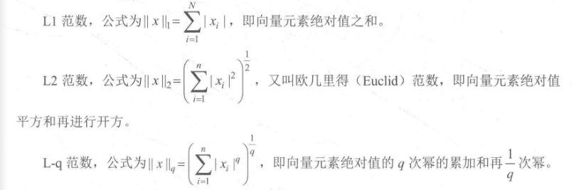

**2.岭回归和LASSO回归**

在原始的损失函数后添加正则项，可以减小模型学习到的θ的大小，可以使模型的泛化能力更强。

对参数空间进行L2范数正则化的线性回归模型成为岭回归，对参数空间进行L1范数正则化的线性模型称为LASSO回归。

#### 5.1.3 回归模型的评估指标和调用方法

|           指标           |      描述      |                           衡量方法                           |
| :----------------------: | :------------: | :----------------------------------------------------------: |
| Mean Absolute Error(MSE) | 平均绝对值误差 |      `from sklearn.metrics import mean_absolute_error`       |
|    Mean Square Error     |    均方误差    |       `from sklearn.metrics import mean_squared_error`       |
|  Root_Mean_Square Error  |   均方根误差   | `from sklearn.metrics import mean_squared_error    `         `from math import sqrt` |
|        R-Squared         |    R 平方值    |            `from sklearn.metrics import r2_score`            |

**1.MAE**

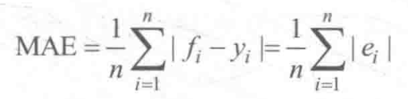

**2.MSE**

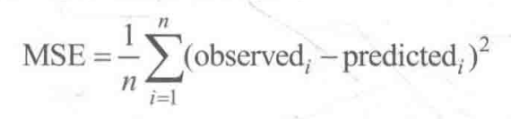

**3.RMSE**

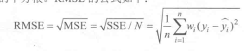

**4.R平方值**

反映了回归模型在多大程度上解释了因变量的变化，或者说模型对观测值的拟合程度。

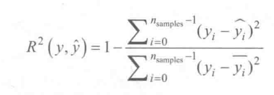

#### 5.1.4 交叉验证

交叉验证是验证分类器性能的一种统计分析方法，其基本思想是在某种意义上将原始数据进行分组，一部分作为训练集，一部分作为验证集。

**1.简单交叉验证**

将数据分为训练集和测试集。通常划分30%的数据作为测试集。

`sklearn.model_selection.train_test_split`

**2. K折交叉验证**

将原始数据均分成K组，然后将每个子集数据分别做一次验证集，其余的K-1组子集数据作为训练集，这样就会得到K个模型。将这K个模型的分类准确率取平均值，作为性能指标。

`sklearn.model_selection.Kfold`

**3. 留一法交叉验证**

N个样本，每次留一个样本作为检验集。最后取N个模型的均值。

`sklearn.model_selection.LeaveOneOut`

**4. 留P法交叉验证**

类似3。

**5 其他交叉验证分割方法**

1. 基于类标签，具有分层的交叉验证。
2. 用于分组数据的交叉验证。
3. 时间序列分割。

### 5.2 模型调参
