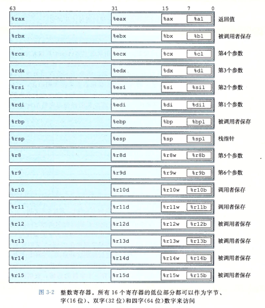

# 0.配环境

安装docker

拉取镜像`docker pull ubuntu:20.04`

创建容器并运行`docker container run -it -v /home/tx/csapp:/csapp --name=csapp_env ubuntu:20.04 /bin/bash`

更新apt软件源`apt update`

安装sudo`apt install sudo `

- 安装c/c++编译环境`sudo apt-get install build-essential gcc-multilib gdb`

# 第二章、数据的表示和处理

64位机器，字长64位，虚拟地址范围2^64-1，程序最多访问2^64个字节。

指针在32位是4字节，64位是8字节。

Windows，Linux，安卓，iOS，都是小端机器。

C语言中字符串被编码为以null(0)结尾的字符数组，例如 “12345” 被编码为 31 32 33 34 35 00,

（十进制数字x的ASCII码为0x3x）

布尔代数（位运算）：~表示NOT，&表示AND，|表示OR，^表示EXCLUSIVE-OR

a^a=0，  0^a=a.

位向量可以表示有限集合，[01101001]   =》 { 0，3，5，6}，[01010101]  => {0,2,4,6}，相应的，

两集合相互&，可得[01000001] => {0,6} ，表示交集。

|表示集合并，~表示集合的补。

掩码运算：x&0xFF生成一个由x最低有效字节组成的值，例如，x=0x89ABCDEF，得到0xEF

移位运算：

C语言中，逻辑左移，逻辑右移，补0；

算术右移，补最高有效位。例如，x=[10010101]，x>>4，x=[*1111*1001]。大多数编译器都是算术右移。x >> 1，相当于除2。

java中，x>>k算术右移，    x>>>k逻辑右移

现代机器中，有符号数都是补码编码，无符号数是无符号数编码。

补码编码：负数最高位为1，例如[1011] = -1*2^3 + 0 + ... = -5  ，[1000] = -8.

无符号数与有符号数在强制类型转换时，位表示不变。

在比较大小时，如果式子中有无符号数，就会将所有数转为无符号数。

符号扩展：将短字节的数赋值给长字节的变量时，无符号数执行0扩展，补码数执行符号扩展。

# 第三章，程序的机器级表示（X86-64）

反汇编指令：`objdump -d mstore.o`

`gcc -Og a.c`  -Og 表示优化机器代码，使其符合原始C代码结构。

数据格式：

| C声明  | Inter数据类型 | 汇编代码后缀 | 大小（字节） |
| ------ | ------------- | ------------ | ------------ |
| char   | 字节          | b            | 1            |
| short  | 字            | w            | 2            |
| int    | 双字          | l            | 4            |
| long   | 四字          | q            | 8            |
| char*  | 四字          | q            | 8            |
| float  | 单精度        | s            | 4            |
| double | 双精度        | l            | 8            |

3.4 16个通用目的寄存器（存储整数数据和指针）：

3.4.1 一条指令包含一个或多个操作数，操作数分为立即数，寄存器和内存引用（存储器）。

3.4.2 mov指令：

五种可能组合：

`movl $0x4050,%eax                  (立即数)Immediate--Register, 4 bytes`

`movw %bp,%sp                        (寄存器)Register--Register , 2 bytes`

`movb (%rdi,%rcx),%al               (内存引用)Memory--Register, 1 bytes`

`movb $-17,(%rsp)                      Immediate--Memory, 1 bytes`

`movq %rax,-12(%rbp)                     Register--Memory, 8 bytes`

注意，不可`Memory--Memory`，只能分成两步，先`Memory--Register`，再`Register--Memory`

3.4.4压入和弹出栈数据：

3.5算术和逻辑操作

大多数操作都分成了指令类，这些指令类有各种带不同大小操作操作数的变种。指令类ADD由四条加法指令组成：addb、addw、addl和addq，分别是字节加法、字加法、双字加法和四字加法。这些操作被分为四组：加载有效地址、一元操作、二元操作和移位。

3.5.1 leaq指令

相当于movq指令

3.5.2 一元和二元操作

第二组是一元操作，操作数可以是一个寄存器或者一个内存位置。

例如，指令`incq(%rsp)`会使栈顶的8字节元素加1。

第三组是二元操作，第二个操作数既是源也是目的。

注意，当第二个操作数是内存地址时，处理器必须从内存读出值，执行操作，再把结果写回内存。

3.5.3 移位操作

k表示移位量，可以是立即数或者放在单字节寄存器`%cl`中。x86-64中，移位操作对w位长的数据值进行操作，移位量由寄存器`%cl`的地m位决定，这里2^m = w. 例如，寄存器`%cl`的值为0xFF时，指令`salb`会移7位，`salw`会移15位，`sall`会移31位，`salq`会移63位。

3.5.5 特殊的算术操作

两个64位整数乘法、除法和取模操作。

3.6 控制

3.6.1条件码

除了整数寄存器，CPU还维护者一组单个位的条件码寄存器，他们描述了最近的算术或逻辑操作的属性，通过检测这些寄存器来执行条件分支指令。

CF：进位标志。最近的操作使最高位产生了进位。可用来检查无符号操作的溢出。

ZF：零标志。最近的操作得出的结果为0.

SF：符号标志。最近的操作得到的结果为负数

OF：溢出标志。最近的操作导致一个补码溢出——正溢出或负溢出。

对于图3-10中除了leaq的所有指令，都该设置条件码，因为leaq指令是用来进行地址计算的。对于逻辑操作，例如XOR，进位标志和溢出标志会设置成0。对于移位操作，进位标志将被设置为最后一个被移出的位，而溢出标志设置为0。INC和DEC指令会设置溢出和零标志，但是不会改变进位标志。

除了图3-10中的指令会设置条件码，还有两类指令他们只设置条件码而不改变任何其他寄存器，如图3-13所示。

3.6.2 访问条件码

条件码通常不会直接读取，常用的使用方法有三种：

1可以根据条件码的某种组合，将一个字节设置为0或者1

2可以条件跳转到程序的某个其他的部分

3可以有条件的传输数据

对于第一种情况，图3-14描述的指令根据条件码的某种组合，将一个字节设置为0或者1，这类指令称为SET指令。

3.6.3 跳转指令

前面所述都是顺序指令， 跳转指令会导致执行切换到程序中一个全新的位置，在汇编代码种，这些跳转的目的地通常用一个标号（label）指明。

3.6.4 跳转指令的编码

两种：1. PC相对的    2. 绝对地址

3.6.5 用条件控制来实现条件分支

3.6.6 用条件传送实现条件分支

条件传送的好处：耗费时钟周期短。处理器通过流水线提高性能，用条件跳转指令很难预测要执行哪个分支的指令。条件传送即是顺序执行，流水线中的指令序列保持满的。

但是条件传送一般不被使用，仅当分支中的表达式都很好计算时才使用。

3.6.8 switch语句

跳转表

3.7 过程

过程是软件中一种重要的抽象，用一组特定的参数和一个可选的返回值实现了某种功能。过程的形式多样：函数（function）、方法（method）、子例程（subroutine）、处理函数（handler）等等。

三个机制：

1. 传递控制。在进入过程Q的时候，程序计数器必须被设置为Q的代码的起始地址，然后在返回时把PC设置为P中调用Q后面那条指令的地址。
2. 传递数据。P必须能够向Q传递一个或多个参数，Q需要返回一个返回值给P。
3. 分配和释放内存。在开始时，Q需要为局部变量分配空间，而在返回前释放这些存储空间。

3.7.1 运行时栈

 

gdb：

`layout asm `显示汇编代码

`stop`停止运行代码

`stepi`执行一行代码

`x/w 0xbffff890 `检查0xbffff890开始的4个字节的数据值

`p *(int*)($rbp)`打印rbp寄存器里的地址对应的值

`ulimit -c unlimited `  允许生成core文件（程序出错时生成）
`ulimit -a`     查看系统设置信息

数据传递：

过程调用传递参数时，前6个参数放在寄存器中，之后的参数通过栈传递，在返回地址上方。

局部存储：有时候，局部数据必须存放在内存中。

1. 寄存器不足够存放所有本地数据。
2. 对一个局部变量使用地址运算符。
3. 局部变量是数组或者结构。    必须能够通过地址引用访问。

数组分配和访问：

整形数组E的起始地址和索引i 分别存放在寄存器 %rdx 和 %rcx 中。

结果存放在%eax（数据） 或 %rax（指针） 中。

| 表达式 | 类型  | 值       | 汇编代码                |
| ------ | ----- | -------- | ----------------------- |
| E      | int * | Xe       | movq %rdx %rax          |
| E[i]   | int   | M[Xe+4i] | movl (%rdx,%rcx,4),%eax |
| &E[2]  | int * | Xe+8     | leaq 8(%rdx),%rax       |

结构体：

结构体的首地址作为指针放在寄存器中，数组的值在栈的局部变量区，通过首地址加上偏移量的引用得到。

联合：联合的大小等于其中最大字段的大小。

数据对齐：

对齐原则是任何K字节的基本对象的地址必须是K的倍数。

| K    | 类型                |
| ---- | ------------------- |
| 1    | char                |
| 2    | short               |
| 4    | int , float         |
| 8    | long, double, char* |

对于 结构体的数组，要注意首地址是第一个元素的字节数的倍数。

函数指针：

int (*f)(int *)：指向以int * 为参数并返回int 的函数的指针。

支持变长栈帧：

%rbp保存栈指针%rsp的位置，称为帧指针或基指针。

