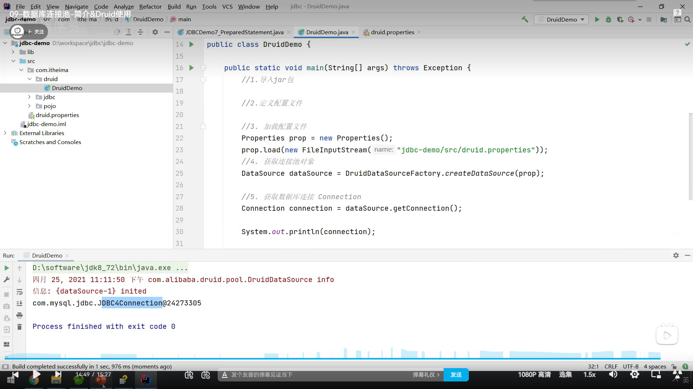

### JDBC

操作关系型数据库的API。官方定义的接口。

```java
String url = "jdbc:mysql://127.0.0.1:3306/db1";
String username = "root";
String password = "123456";
Connection conn =DriverManager.getConnection(url,username,password);
Statement st = conn.createStatement();
String sql = "update user set money = 3000 where id = 1";
int count = st.executeUpdate(sql);
st.close();
conn.close();
```

```java
String url = "jdbc:mysql://127.0.0.1:3306/db1";
        String username = "root";
        String password = "123456";
        Connection conn = DriverManager.getConnection(url,username,password);
        Statement st = conn.createStatement();
        try {//开启事务
            conn.setAutoCommit(false);
            String sql = "update user set money = 6000 where id = 1";
            String sql1 = "update user set money = 6000 where id = 2";
            st.execute(sql);
            st.execute(sql1);
            conn.commit();//提交事务

        } catch (Exception e) {
            //回滚事务
            conn.rollback();
            throw new RuntimeException(e);
        }
        st.close();
        conn.close();
```

PreparedStatement :预编译SQL，性能更高，防止SQL注入。

数据库连接池：容器，分配、管理数据库连接。



### mybatis

### maven

项目管理工具    编译--打包--