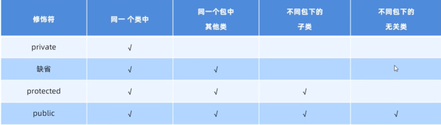
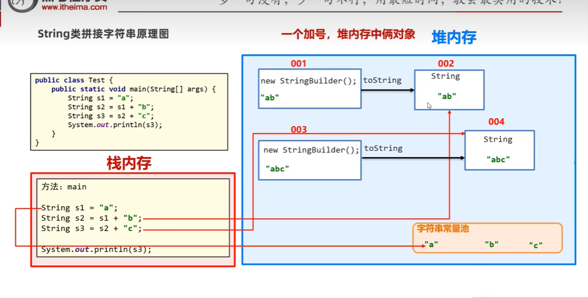
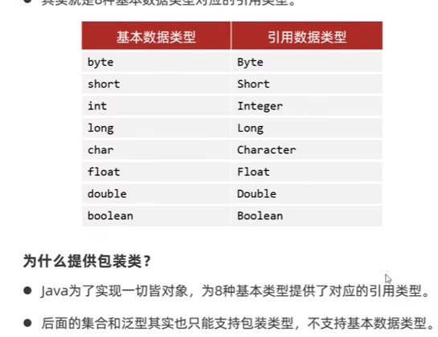
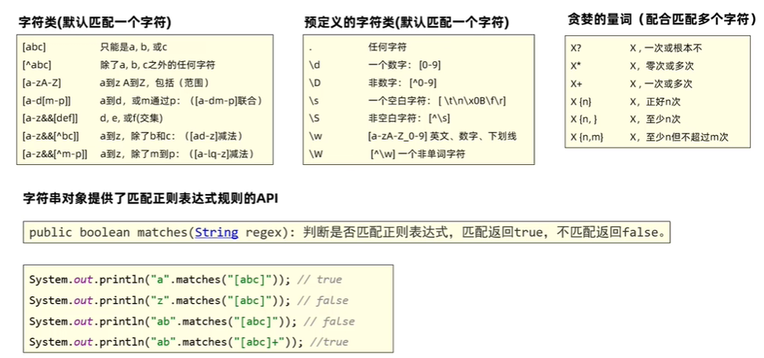
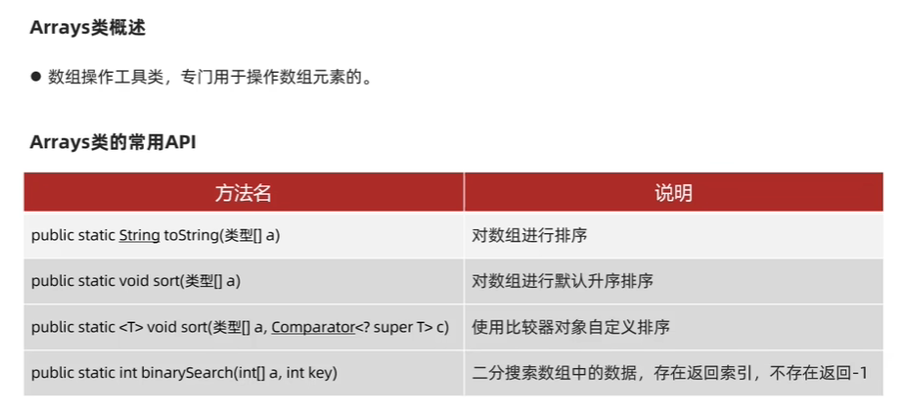
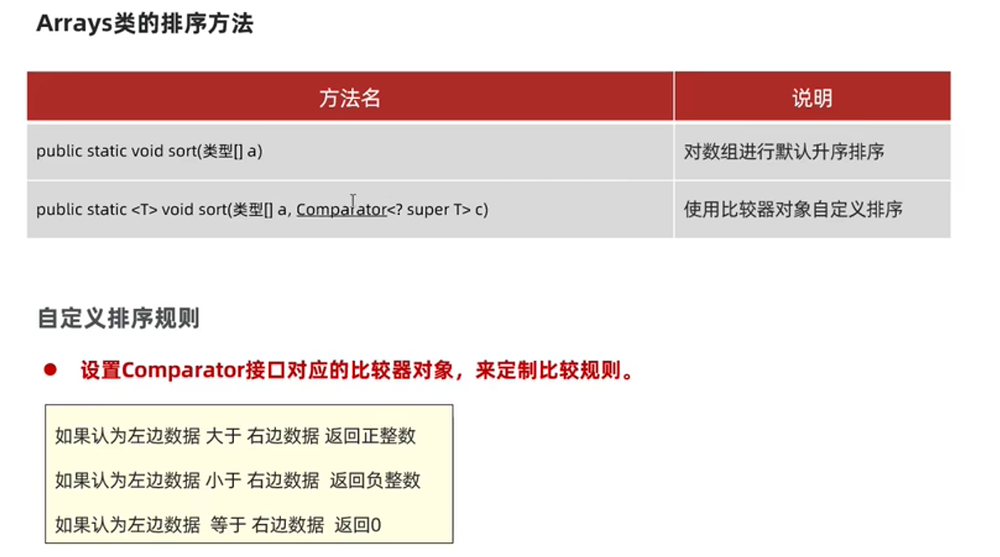
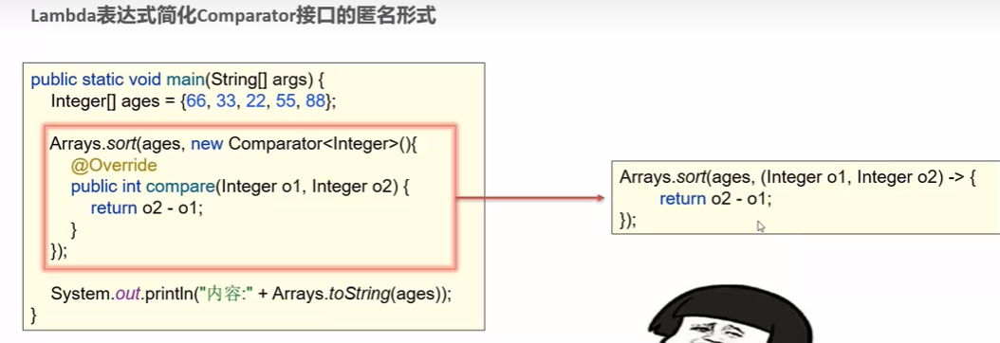
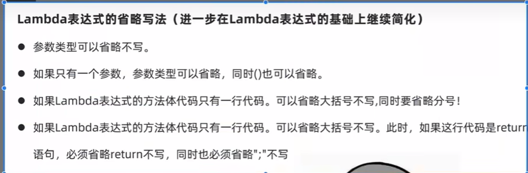
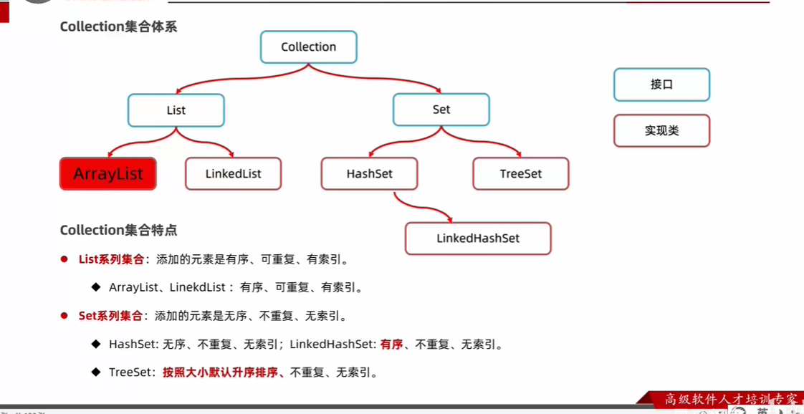

**工具类**：1：内部都是静态方法，完成各个功能

2. 一次编写，处处可用。
3. 不需要创建对象，构造函数私有化。

**代码块**：

1. static{}修饰，静态代码块，可用于初始化静态资源。
2. {}， 实例代码块，生成实例时触发，可初始化实例资源。

**单例模式**：只能生成一个类

**饿汉单例模式**

1. 构造器私有
2. 定义一个静态变量提供外界一个实例

**懒汉单例模式**

1. 延迟加载对象（需要时加载）
2. 构造私有
3. 定义一个静态变量但是不new，另外写一个方法创建对象

**继承**：extends

特点：1. 子类可以继承父类的属性和行为，但是不能继承父类的构造器

2. java是单继承模式，只能继承一个父类
3. Java中所有类都是Object 的子类

用super 调父类中的属性或方法

子类中重写方法时，最好加注解@Override，可校验重写是否正确

权限修饰符




**final** 作用

修饰类：不可被继承

修饰方法：不可被重写

修饰变量：1. 只能被赋值一次

2. 变量是基本类型，数据值不可改变
3. 引用类型，地址不可改变

常量：public static final 修饰的成员变量，必须由初始化值，且不可变

常量编译阶段会进行“宏替换”，将常量替换成真实的字面值

**抽象类：**public abstract class 

类似于C++的纯虚函数，子类必须实现

**接口**：

1. default方法，实现类的实例调用

2. static方法 ， 只能接口调用

接口是用来被类是实现的，一个类可以实现多个接口

接口之间可以多继承

**多态	**：父类变量  = new 子类实例

instanceof 判断对象类型

 **Object**类：

tostring（）方法 ：输出类的地址，子类可重写后，输出类的内容

equals（） 方法：默认比较对象地址，子类可重写后，比较两个对象的内容

getclass（）返回对象的类型

**StringBuilder** 字符串类：

String拼接效率很低，StringBuilder.append（）性能好



**system类**：

1.exit（）终止java虚拟机

2.current Time Millis（）返回当前系统时间毫秒值

3.array copy（），数组拷贝


 **Bigdecimal:	**解决精度问题

.valueof() 将数据转换成BigDecimal对象


Date    SimpleDataFormat  类

java8 开始新的日期和时间API：


**包装类：**




**正则表达式：	**




**Arrays类：	**	





**匿名内部类：	**

无需定义子类，直接生成匿名内部类对象，实现父类的方法。

例如GUI编程中的ActionListen。。。

函数式接口：接口且有一个抽象方法

lambda表达式 ， 改 -->（ ）{}






集合：1. 变长

2. 只能存储引用数据类型   3. 增删改查方便

collection 单列集合：




遍历：1. 迭代器 iterator

```java
Iterator<String> it = lists.iterator();
while(it.hasNext()){
 String e = it.next();
 System.out.print(e);
}
```

2. for each遍历 

3. Lambda 表达式 


map  双列集合


