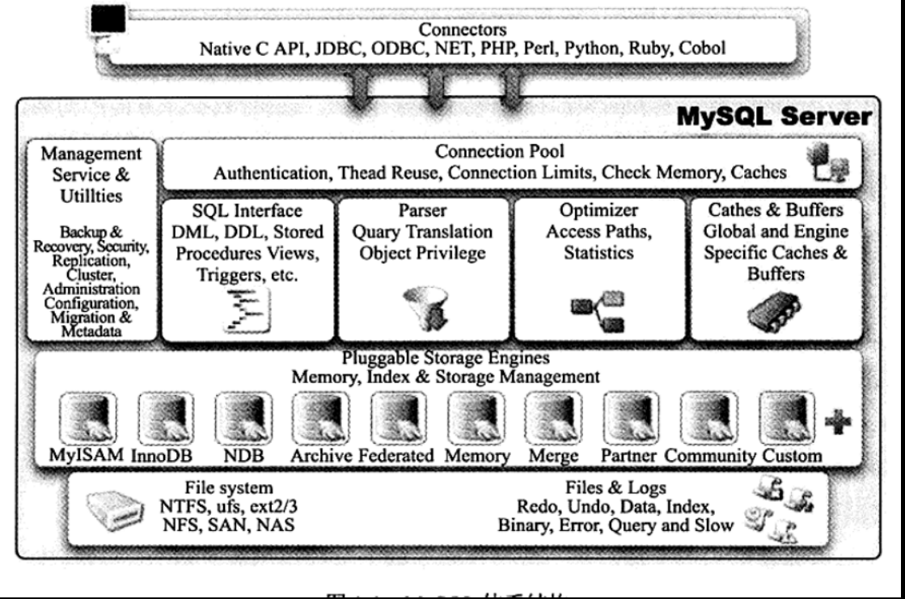
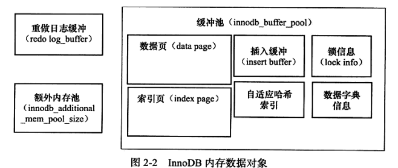

## 一、Mysql体系结构与存储引擎

### 1.1、定义数据库与实例

`mysql --help | grep my.cnf`查找Mysql启动配置文件

### 1.2、mysql体系结构

区别于其他数据库，mysql的特点就是其插件式的表存储引擎。

注意：存储引擎是基于表的，而不是基于数据库。

### 1.3、存储引擎

存储引擎是mysql中最重要的一部分。

#### 1.3.1 InnoDB存储引擎

面向在线事务处理（OLTP）的应用。

优点：行锁设计、支持外键、支持类似于Oracle的非锁定读，即默认读取操作不会产生锁。

InnoDB将数据放在一个逻辑的表空间中，这个表空间就像黑盒一样由存储引擎自身管理。每一个InnoDB的表单放在独立的ibd文件中。

InnoDB使用多版本并发控制（MVCC）来获得高并发性，并实现4种隔离级别。

对于数据的存储，采用聚集的方式。

## 二、InnoDB存储引擎

### 2.3InnoDB体系架构

存储引擎有多个内存块，组成一个内存池，负责如下工作：

- 维护所有进程/线程需要访问的多个内部数据结构
- 缓存磁盘上的数据，方便的读取，同时在对磁盘文件的数据修改之前在这里缓存
- 重做日志缓冲

后台线程主要负责刷新内存池中的数据，保证缓冲池中的内存缓存的是最近的数据。

#### 2.3.1 后台线程

1. master 线程

将缓冲池中的数据异步刷新到磁盘，保证数据的一致性，包括脏页的刷新、合并插入缓冲、UNDO页的回收等。

2. IO 线程

大量使用AIO（Async IO）来处理写IO请求，可以极大提高性能。

IO线程主要负责IO请求的回调（callback）处理。

`show engine innodb status;`观察线程状态

3. Purge Thread

回收UNDO页

4. Page Cleaner Thread

将脏页刷新操作放到单独的线程中处理。

#### 2.3.2 内存

**1.缓冲池**

InnoDB是基于磁盘存储的，由于磁盘速度和CPU速度相差很大，所以使用缓冲池。

读取页使，首先将读取到的页放到内存中，下一次再读时，判断是否在内存中，若在，则称该页在缓冲池中被命中。

修改页时，先修改在缓冲池中的页，再以一定的频率（checkpoint机制）刷新到磁盘上。

`select pool_id,pool_size,free_buffers,database_pages from innodb_buffer_pool_stats;`查看缓冲池状态

**2. LRU list，Free list， Flush List**

缓冲池通过LRU算法来管理内存。经常使用的在LRU列表的前面，很少使用的在后面。当缓冲池不能存放新读取的页时，首先释放LRU列表尾端的页。

// 看书。。。

在LRU列表中的页被修改后，被称为脏页。此时数据库会通过checkpoint机制将脏页刷新回磁盘。而Flush列表中即为脏页。

**3. 重做日志缓冲**

内存区域。首先将日志信息放到内存区域，然后按一定频率刷新到日志文件。

`show variables like 'innodb_log_buffer_size';`查看重做日志缓冲大小

**4. 额外的内存池**

内存堆。在对一些数据结构本身的内存进行分配时，需要从额外的内存池中申请。

### 2.4 checkpoint技术

解决几个问题：

- 缩短数据库的恢复时间
- 缓冲池不够用时，将脏页刷新到磁盘；
- 重做日志不可用时，刷新脏页

两种checkpoint：

- sharp checkpoint，数据库关闭时将所有的脏页刷新回磁盘
- Fuzzy checkpoint，数据库运行时使用

Fuzzy checkpoint常用集中：

- Master Thread Checkpoint
- FLUSH_LRU_LIST checkpoint
- Async/Sync Flush Checkpoint
- Dirty Page too much Checkpoint

### 2.5 Master Thread 工作方式

//书

### 2.6 关键特性

