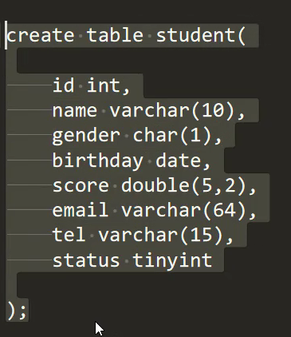
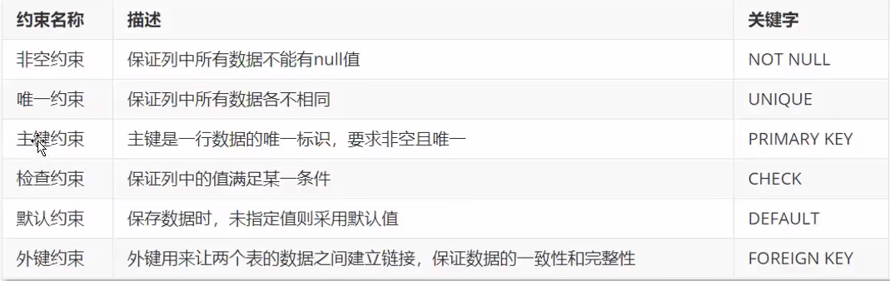

1.4 mysql服务的关闭与启动（默认开机自动启动，如果想手动操作，可以参考如下命令）

关闭：`net stop mysql80`
启动：`net start mysql80`
1.5 mysql的常用操作

连接用户名为root，密码为123456的数据库服务：`mysql -uroot -p123456`
`show databases;`：列出所有数据库
`create database kob;`：创建数据库
`drop database kob;`：删除数据库
`use kob;`：使用数据库kob
`show tables;`：列出当前数据库的所有表
`create table user(id int, username varchar(100));`：创建名称为user的表，表中包含id和username两个属性。
`drop table user;`：删除表
`insert into user values(1, 'yxc');`：在表中插入数据
`select * from user;`：查询表中所有数据
`delete from user where id = 2;`：删除某行数据

`alter table user modify id varchar(10)`:修改数据类型	

约束的概念：约束是作用于表中列的规则，限制加入表中的数据。

事务：

- 事务是一组操作序列，包含一组数据库操作命令。
- 事务把所有的命令作为一个整体向系统提交或撤销操作请求。
- 事务是一个不可分割的工作逻辑单元。

开启事务  `begin; `

提交事务   `commit;`

回滚事务  `rollback;`

