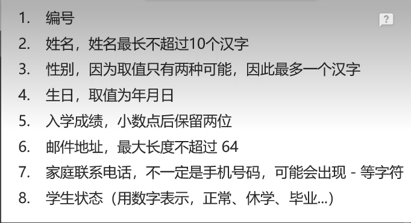

1.4 mysql服务的关闭与启动（默认开机自动启动，如果想手动操作，可以参考如下命令）

关闭：`net stop mysql80`
启动：`net start mysql80`
1.5 mysql的常用操作

连接用户名为root，密码为123456的数据库服务：`mysql -uroot -p123456`
`show databases;`：列出所有数据库
`create database kob;`：创建数据库
`drop database kob;`：删除数据库
`use kob;`：使用数据库kob
`show tables;`：列出当前数据库的所有表
`create table user(id int, username varchar(100));`：创建名称为user的表，表中包含id和username两个属性。
`drop table user;`：删除表
`insert into user values(1, 'yxc');`：在表中插入数据
`select * from user;`：查询表中所有数据
`delete from user where id = 2;`：删除某行数据

`alter table user modify id varchar(10)`:修改数据类型	

约束的概念：约束是作用于表中列的规则，限制加入表中的数据。

事务：

- 事务是一组操作序列，包含一组数据库操作命令。
- 事务把所有的命令作为一个整体向系统提交或撤销操作请求。
- 事务是一个不可分割的工作逻辑单元。

开启事务  `begin; `

提交事务   `commit;`

回滚事务  `rollback;`

`show columns fron customers;` 列出表中的字段信息  或者 `describe customers;`

`help show;`显示允许的 show 语句。

**检索数据**

`select distinct vend_id from products;`检索一个字段并去重

`select prod_name from products limit 5`检索并限制返回的行数

`select prod_name from products limit 5,5`返回行5开始的5行

`select prod_name from products order by prod_name`排序后返回

`select prod_name from products order by prod_price,prod_name`按多个列排序

`select prod_id, prod_price, prod_name from products order by prod_price desc;`降序排列

`select prod_id, prod_price order by prod_price desc limit 1;`找出最大值

**过滤数据**

`select prod_price from products where prod_price  = 2.50;`

`select prod_name,prod_price from products where prod_price between 5 and 10;`范围检查

`select cust_id from customers where cust_email is null;`检查null值

**数据过滤**

`select prod_id, prod_price,prod_name from products where vend_id = 1003 and prod_price <= 10;` AND操作符

`select prod_price,prod_name from products where vend_id = 1003 or vecd_id = 1002;`OR操作符

AND操作符优先级比OR高；

`select prod_price,prod_name from products where vend_id in (1002,1003)`IN操作符

`select prod_price,prod_name from products where vend_id not in (1002,1003)`NOT操作符

**通配符**

%通配符，匹配任意字符

`select prod_price,prod_name from products where prod_name like 'jet%';`以jet开头的产品

`select prod_price,prod_name from products where prod_name like '%anvil%';`匹配两端

_ 通配符， 匹配一个字符

`select prod_price,prod_name from products where prod_name like '_ ton anvil';`

**正则表达式匹配**

`select prod_name from products where prod_name regexp '1000|2000' order by prod_name;`名字中包含1000 或者 2000 的

`select prod_name from products where prod_name regexp '[123] ton' order by prod_name;`【123】表示1或者2或者3

【1-9】表示匹配1到9中的任意一个字符

`select vend_name from vendors where prod_name regexp '.' order by vend_name`匹配任意字符

`select vend_name from vendors where prod_name regexp '\\.' order by vend_name;`查找  .  

匹配字符类

`select prod_name from products where prod_name regexp '\\([0-9] sticks?\\)';`

`select prod_name from products where prod_name regexp '^[0-9\\.]' oroder by prod_name`匹配以数字0-9或者. 开头的

**创建计算字段**

`select concat(vend_name,'(',vend_country,')') from vendors order by vend_name;`

