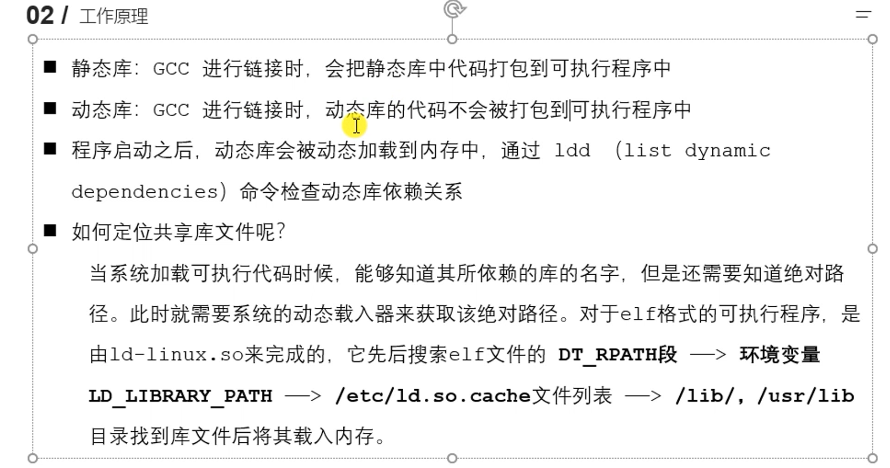

# 网络编程

## 基础API

**iovec结构体**

```cpp
struct iovec
{
void*iov_base;/*内存起始地址*/
size_t iov_len;/*这块内存的长度*/
};
```

**readv 和 writev 函数**

readv函数将数据从文件描述符读到分散的内存块中，即分散读；writev函数则将多块分散的内存数据一并写入文件描述符中，即集中写。

```cpp
#include＜sys/uio.h＞
ssize_t readv(int fd,const struct iovec*vector,int count)；
ssize_t writev(int fd,const struct iovec*vector,int count);
成功时返回字节数，失败时返回-1并设置errno
```


#### 动态库和静态库

动态库： libxxx.so    xxx是名字

制作过程：

- `gcc -c -fpic/-fPIC a.c b.c`
- `gcc -shared a.o b.o -o libcalc.so`

加载命令：gcc psserver.c -o psserver -L ./ -I stringmap



`ldd main`查看main文件的动态库依赖。main是编译后的可执行文件。

查看环境变量：`echo $LD_LIBRARY_PATH`

1. 添加环境变量：`export LD_LIBRARY_PATH=$LD_LIBRARY_PATH:/home/tx/project`  关闭终端会失效

							2. 在`~`目录下修改 `.bashrc`，输入同上式。 然后更新配置`source .bashrc`
							2. 修改`sudo vim /etc/profile`，输入同（1）式。然后`source /etc/profile`
							2. 修改`etc/ld.so.conf`	
							2. 不建议放到 `/lib/,/usr/lib/`					

## 系统函数

```cpp
#include <sys/stat.h>
int stat(const char *pathname, struct stat *statbuf);
// 获取文件属性， pathname 操作文件的路径 ， statbuf 结构体变量，传出参数

int lstat(const char *pathname, struct stat *statbuf);
int fstat(int fd, struct stat *statbuf);
以上函数成功时返回0 ， 否则-1
```


```cpp
struct stat {
dev_t st_dev;			/* 文件所在设备的 ID */
ino_t st_ino;			/* 文件的 i-node 号 */
mode_t st_mode;			/* 文件类型和权限 */         mode_t 如下图
nlink_t st_nlink;		/* 文件的（硬）链接数量 */
uid_t st_uid;			/* 文件拥有者的用户 ID */
gid_t st_gid;			/* 文件拥有者的组 ID */
dev_t st_rdev;			/* 设备特殊文件的 ID */
off_t st_size;			/* 文件总大小(字节) */
blksize_t st_blksize;	/* 执行 I/O 的最佳块大小(字节) */
blkcnt_t st_blocks;		/* 已分配块(512B)的数量 */
time_t st_atime;		/* 文件的最后访问时间 */
time_t st_mtime;		/* 文件的最后修改时间 */
time_t st_ctime;		/* 文件的最后状态变化时间 */
};
```


**解析命令行选项getopt**

```cpp
#include<unistd.h>

extern int optind,opterr,optopt;//optind 用于检索下一个检索位置 opterr 用于表示将错误信息输出到stderr optopt 表示不在选项字符串optstring中的选项 
extern char* optarg; //optarg 用来保存选项的参数

int getopt(int argc,char* const argv[],const char* optstring);
//optstring表示支持的选项，后面有冒号表示必须带有参数，两个冒号表示可带可不带
```


## 高级I/O函数

**1.pipe**

```c
#include<unistd.h>
int pipe(int fd[2]);
```

用于创建管道，fd[1]只能用于写数据，fd[0]只能用于读数据。

默认情况下这一对文件描述符都是阻塞的。


**socketpair**

```cpp
#include<sys/types.h>
#include<sys/socket.h>
int socketpair(int domain,int type,int protocol,int fd[2]);
//fd[2]表示双向管道，可双向读写
```


**mmap函数**

mmap函数用于申请一段内存空间。我们可以将这段内存作为进程间通信的共享内存，也可以将文件直接映射到其中。

```cpp
#include＜sys/mman.h＞
void*mmap(void*start,size_t length,int prot,int flags,int fd,off_t offset);
//start参数允许用户使用某个特定的地址作为这段内存的起始地址。设置成NULL，系统自动分配一个地址。
//prot参数用来设置内存段的访问权限。
//flags参数控制内存段内容被修改后程序的行为。
//offset参数设置从文件的何处开始映射
成功时返回指向目标区域的指针
int munmap(void*start,size_t length);
```


**splice函数**

```c
#include<fcntl.h>
ssize_t splice(int fd_in, loff_t* off_in, int fd_out, loff_t*off_out, size_t len, unsigned int flags);
//fd_in是待读取数据的文件描述符，如果是管道文件描述符，则off_in 必须为NULL；如果不是，那么off_in 表示从输入数据流的何处开始读数据。
//fd_out 和 off_out 与它们含义相同
//len 指定移动数据的长度
//flag 控制数据如何移动
```

用于在两个文件描述符之间移动数据，也是零拷贝操作。

fd_in 和fd_out 至少有一个是管道文件描述符。

调用成功时返回移动字节的数量。

**dup2**

有时我们希望把标准输入重定向到一个文件，或者把标准输出重定向到一个网络连接（比如CGI编程）。这可以通过下面的用于复制文件描述符的dup或dup2函数来实现：

```cpp
#include＜unistd.h＞
int dup(int file_descriptor);//创建一个新的文件描述符指向file_descriptor，一般取当前可用最小整数值
int dup2(int file_descriptor_one,int file_descriptor_two);
//创建file_descriptor_two于file_descriptor_one指向一样
dup2和dup创建的文件描述符不继承原文件描述符的属性，比如close-on-exec和non-blocking
```


## tcp客户端和服务器实例

**server代码如下：**

```c
#include<sys/socket.h>//socket
#include<stdio.h>//printf
#include<stdlib.h>//exit
#include<arpa/inet.h>//htons inet_addr
#include<unistd.h>//close
#include<sys/types.h>
#include<netinet/in.h>//sockaddr_in
#include<string.h>
int main(int argc,char *argv[]){
    if(argc<3){
        fprintf(stderr,"Usage: %s [ip] [port]\n",argv[0]);
        exit(1);
    }

    int sockfd;
    if((sockfd=socket(AF_INET,SOCK_STREAM,0))==-1){
        perror("fail to socket");
        exit(1);
    }

    struct sockaddr_in serveraddr;
    socklen_t addrlen=sizeof(serveraddr);
    serveraddr.sin_addr.s_addr=inet_addr(argv[1]);
    serveraddr.sin_port=htons(atoi(argv[2]));
    serveraddr.sin_family=AF_INET;

    if((bind(sockfd,(struct sockaddr*)&serveraddr,addrlen))==-1){
        perror("fail to bind");
        exit(1);
    }

    if(listen(sockfd,10)==-1){
        perror("fail to listen");
        exit(1);
    }

    int acceptfd;
    struct sockaddr_in clientaddr;
    if((acceptfd=accept(sockfd,(struct sockaddr*)&clientaddr,&addrlen))==-1){
        perror("fail to accept");
        exit(1);
    }

    printf("ip=%s , port=%d\n",inet_ntoa(clientaddr.sin_addr),ntohs(clientaddr.sin_port));

    char buf[128]="";
    if(recv(acceptfd,buf,128,0)==-1){
        perror("fail to recv");
        exit(1);
    }
    printf("from client: %s\n",buf);

    strcat(buf,"---");
    if(send(acceptfd,buf,128,0)==-1){
        perror("fail to send");
        exit(1);
    }

    close(acceptfd);
    close(sockfd);
    return 0;
}

```

**client代码如下：**

```c
#include<sys/socket.h>//socket
#include<stdio.h>//printf
#include<stdlib.h>//exit
#include<arpa/inet.h>//htons inet_addr
#include<unistd.h>//close
#include<sys/types.h>
#include<netinet/in.h>//sockaddr_in
#include<string.h>
int main(int argc,char *argv[]){
    if(argc<3){
        fprintf(stderr,"Usage: %s [ip] [port]\n",argv[0]);
        exit(1);
    }

    int sockfd;
    if((sockfd=socket(AF_INET,SOCK_STREAM,0))==-1){
        perror("fail to socket");
        exit(1);
    }

    struct sockaddr_in clientaddr;
    clientaddr.sin_addr.s_addr=inet_addr(argv[1]);
    clientaddr.sin_port=htons(atoi(argv[2]));
    clientaddr.sin_family=AF_INET;

    if(connect(sockfd,(struct sockaddr*)&clientaddr,sizeof(clientaddr))==-1){
        perror("fail to connnect");
        exit(1);
    }

    char buf[128]="";
    fgets(buf,128,stdin);
    buf[strlen(buf)-1] = '\0';
    if(send(sockfd,buf,128,0)==-1){
        perror("fail to send");
        exit(1);
    }

    char text[128]="";
    if(recv(sockfd,text,128,0)==-1){
        perror("fail to recv");
        exit(1);
    }
    printf("from server: %s\n",text);
    close(sockfd);
    return 0;
}

```

**运行截图：**


## TCP多进程多线程实现并发实例

**客户端代码如下：**

```c
#include <stdio.h>
#include <stdlib.h>
#include <unistd.h>
#include <sys/types.h>
#include <sys/socket.h>
#include <arpa/inet.h>
#include <netinet/in.h>
#include <string.h>

#define N 128
#define ERR_LOG(errmsg) do{\
                            perror(errmsg);\
                            exit(1);\
                        }while(0)

int main(int argc, char const *argv[])
{
    if(argc < 3)
    {
        fprintf(stderr, "Usage: %s <server_ip> <server_port>\n", argv[0]);
        exit(1);
    }    

    int sockfd;
    struct sockaddr_in serveraddr;

    //第一步：创建套接字
    if((sockfd = socket(AF_INET, SOCK_STREAM, 0)) < 0)
    {
        ERR_LOG("fail to socket");
    }

    //第二步：填充服务器网络信息结构体
    serveraddr.sin_family = AF_INET;
    serveraddr.sin_addr.s_addr = inet_addr(argv[1]);
    serveraddr.sin_port = htons(atoi(argv[2]));

    //第三步：发送客户端连接请求
    if(connect(sockfd, (struct sockaddr *)&serveraddr, sizeof(serveraddr)) < 0)
    {
        ERR_LOG("fail to connect");
    }

    //第四步：进行通信
    char buf[N] = "";
    while(1)
    {
        fgets(buf, N, stdin);
        buf[strlen(buf) - 1] = '\0';

        if(send(sockfd, buf, N, 0) < 0)
        {
            ERR_LOG("fail to send");
        }

        if(strncmp(buf, "quit", 4) == 0)
        {
            exit(0);
        }

        if(recv(sockfd, buf, N, 0) < 0)
        {
            ERR_LOG("fail to recv");
        }

        printf("from server: %s\n", buf);
    }

    //第四步：关闭套接字
    close(sockfd);

    return 0;
}
```

**multi-process-server多进程代码如下：**

```c
#include <stdio.h>
#include <stdlib.h>
#include <unistd.h>
#include <sys/types.h>
#include <sys/socket.h>
#include <arpa/inet.h>
#include <netinet/in.h>
#include <string.h>
#include <signal.h>
#include <sys/wait.h>
#include <signal.h>

//使用多进程实现TCP并发服务器

#define N 128
#define ERR_LOG(errmsg) do{\
                            perror(errmsg);\
                            exit(1);\
                        }while(0)

void handler(int sig)
{
    wait(NULL);
}

int main(int argc, char const *argv[])
{
    if(argc < 3)
    {
        fprintf(stderr, "Usage: %s <server_ip> <server_port>\n", argv[0]);
        exit(1);
    }    

    int sockfd, acceptfd;
    struct sockaddr_in serveraddr, clientaddr;
    socklen_t addrlen = sizeof(serveraddr);

    //第一步：创建套接字
    if((sockfd = socket(AF_INET, SOCK_STREAM, 0)) < 0)
    {
        ERR_LOG("fail to socket");
    }

    //将套接字设置为允许重复使用本机地址或者为设置为端口复用
    int on = 1;
    if(setsockopt(sockfd, SOL_SOCKET, SO_REUSEADDR, &on, sizeof(on)) < 0)
    {
        ERR_LOG("fail to setsockopt");
    }

    //第二步：填充服务器网络信息结构体
    serveraddr.sin_family = AF_INET;
    serveraddr.sin_addr.s_addr = inet_addr(argv[1]);
    serveraddr.sin_port = htons(atoi(argv[2]));

    //第三步：将套接字与服务器网络信息结构体绑定
    if(bind(sockfd, (struct sockaddr *)&serveraddr, addrlen) < 0)
    {
        ERR_LOG("fail to bind");
    }

    //第四步：将套接字设置为被动监听状态
    if(listen(sockfd, 5) < 0)
    {
        ERR_LOG("fail to listen");
    }

    //使用型号，异步的方式处理僵尸进程
    signal(SIGCHLD, handler);

    while(1)
    {
        //第五步：阻塞等待客户端的连接请求
        if((acceptfd = accept(sockfd, (struct sockaddr *)&clientaddr, &addrlen)) < 0)
        {
            ERR_LOG("fail to accept");
        }

        //打印客户端的信息
        printf("%s -- %d\n", inet_ntoa(clientaddr.sin_addr), ntohs(clientaddr.sin_port));

        //使用fork函数创建子进程，父进程继续负责连接，子进程负责与客户端通信
        pid_t pid;
        if((pid = fork()) < 0)
        {
            ERR_LOG("fail to fork");
        }
        else if(pid > 0) //父进程负责执行accept，所以if语句结束后继续在accept函数的位置阻塞
        {
        }
        else //子进程负责跟指定的客户端通信
        {
            char buf[N] = "";
            ssize_t bytes;
            while (1)
            {
                if((bytes = recv(acceptfd, buf, N, 0)) < 0)
                {
                    ERR_LOG("fail to recv");
                }
                else if(bytes == 0)
                {
                    printf("The client quited\n");
                    exit(0);
                }

                if(strncmp(buf, "quit", 4) == 0)
                {
                    exit(0);
                }

                printf("from client: %s\n", buf);

                strcat(buf, " ^_^");
                if(send(acceptfd, buf, N, 0) < 0)
                {
                    ERR_LOG("fail to send");
                }
            }
        }
    }

    return 0;
}
```

**结果如下：**


**多线程服务器（multi-thread-server）代码如下：**

```c
#include <stdio.h>
#include <stdlib.h>
#include <unistd.h>
#include <sys/types.h>
#include <sys/socket.h>
#include <arpa/inet.h>
#include <netinet/in.h>
#include <string.h>
#include <signal.h>
#include <pthread.h>

#define N 128
#define ERR_LOG(errmsg) do{\
                            perror(errmsg);\
                            exit(1);\
                        }while(0)

typedef struct{
    struct sockaddr_in addr;
    int acceptfd;
}MSG;

void *pthread_fun(void *arg)
{
    char buf[N] = "";
    ssize_t bytes;
    MSG msg = *(MSG *)arg;
    while (1)
    {
        if((bytes = recv(msg.acceptfd, buf, N, 0)) < 0)
        {
            ERR_LOG("fail to recv");
        }
        else if(bytes == 0)
        {
            printf("The client quited\n");
            pthread_exit(NULL);
        }

        if(strncmp(buf, "quit", 4) == 0)
        {
            printf("The client quited\n");
            pthread_exit(NULL);
        }

        printf("[%s - %d]: %s\n", inet_ntoa(msg.addr.sin_addr), ntohs(msg.addr.sin_port), buf);

        strcat(buf, " ^_^");
        if(send(msg.acceptfd, buf, N, 0) < 0)
        {
            ERR_LOG("fail to send");
        }
    }
}

int main(int argc, char const *argv[])
{
    if(argc < 3)
    {
        fprintf(stderr, "Usage: %s <server_ip> <server_port>\n", argv[0]);
        exit(1);
    }    

    int sockfd, acceptfd;
    struct sockaddr_in serveraddr, clientaddr;
    socklen_t addrlen = sizeof(serveraddr);

    //第一步：创建套接字
    if((sockfd = socket(AF_INET, SOCK_STREAM, 0)) < 0)
    {
        ERR_LOG("fail to socket");
    }

    //将套接字设置为允许重复使用本机地址或者为设置为端口复用
    int on = 1;
    if(setsockopt(sockfd, SOL_SOCKET, SO_REUSEADDR, &on, sizeof(on)) < 0)
    {
        ERR_LOG("fail to setsockopt");
    }

    //第二步：填充服务器网络信息结构体
    serveraddr.sin_family = AF_INET;
    serveraddr.sin_addr.s_addr = inet_addr(argv[1]);
    serveraddr.sin_port = htons(atoi(argv[2]));

    //第三步：将套接字与服务器网络信息结构体绑定
    if(bind(sockfd, (struct sockaddr *)&serveraddr, addrlen) < 0)
    {
        ERR_LOG("fail to bind");
    }

    //第四步：将套接字设置为被动监听状态
    if(listen(sockfd, 5) < 0)
    {
        ERR_LOG("fail to listen");
    }

    while(1)
    {
        //第五步：阻塞等待客户端的连接请求
        if((acceptfd = accept(sockfd, (struct sockaddr *)&clientaddr, &addrlen)) < 0)
        {
            ERR_LOG("fail to accept");
        }

        //打印客户端的信息
        //printf("%s -- %d\n", inet_ntoa(clientaddr.sin_addr), ntohs(clientaddr.sin_port));

        //创建子线程与客户端进行通信
        MSG msg;
        msg.addr = clientaddr;
        msg.acceptfd = acceptfd;
        pthread_t thread;
        if(pthread_create(&thread, NULL, pthread_fun, &msg) != 0)
        {
            ERR_LOG("fail to pthread_create");
        }
        pthread_detach(thread);
    }

    return 0;
}
```

**结果如下：**


### sendto(udp发送数据)

```c
#include<sys/socket.h>//socket
#include<stdio.h>//printf
#include<stdlib.h>//exit
#include<arpa/inet.h>//htons inet_addr
#include<unistd.h>//close
#include<sys/types.h>
#include<netinet/in.h>//sockaddr_in
#include<string.h>

int main(int argc,char *argv[]){
    //1.create socket
    int sockfd;
    if((sockfd=socket(AF_INET,SOCK_DGRAM,0))==-1){
        perror("fail to socket");
        exit(1);
    }
    printf("sockfd=%d",sockfd);

    //2. create server

    struct sockaddr_in address;
    address.sin_family = AF_INET;
    address.sin_port=htons(9999);
    address.sin_addr.s_addr=inet_addr("192.168.31.144");
    
    //3. send date
    char buf[128]="";
    while (1)
    {
        fgets(buf,128,stdin);
        buf[strlen(buf)-1]='\0';

        if(sendto(sockfd,buf,128,0,(struct sockaddr*)&address,sizeof(address))==-1){
            perror("fail to sendto");
            exit(1);
        }
    }
    //4.close
    close(sockfd);
    return 0;
}

```

### I/O模型

https://zhuanlan.zhihu.com/p/115912936


### 领导者追随者模式

leader：任何时间只有一个领导者，负责监听I/O事件。

Follower：追随者，通过调用线程集的join方法等待成为新的领导者。

检测到I/O事件时：

1.领导者先调用promote_new_leader来推选新的领导者，随后处理I/O事件，新的领导者监听I/O事件。2.处理完事件后，如果当前进程中没有领导者，它就成为领导者，否则成为追随者。


包含以下几个组件：


**1.句柄集**：句柄（Handle）表示I/O资源，即文件描述符。句柄集（Handle Set）管理众多句柄，使用wait_for_event() 方法监听句柄上的I/O事件，并将就绪事件通知给领导者，领导者调用绑定到Handle上的事件处理器（通过register_handle()）来处理事件。

**2.线程集**：管理所有工作线程，包含领导者线程和追随者线程。所有线程有三种状态：Leader、Processing、Follower。

**3.事件处理器**：事件处理器与句柄绑定，当句柄上有事件发生时，领导者就执行与该事件绑定的事件处理器中的回调函数handle_event())）。Concrete Event Handle 处理特定事件。


## 服务器编程框架

| 模块         | 功能                       |
| ------------ | -------------------------- |
| I/O处理单元  | 处理客户连接，读写网络数据 |
| 逻辑单元     | 业务进程或者线程           |
| 网络存储单元 | 数据库、文件、缓存         |
| 请求队列     | 各单元之间的通信方式       |

I/O 处理单元是服务器管理客户连接的模块。它通常要完成以下工作：等待并接受新的客户连接，接收
客户数据，将服务器响应数据返回给客户端。但是数据的收发不一定在 I/O 处理单元中执行，也可能在
逻辑单元中执行，具体在何处执行取决于事件处理模式。

一个逻辑单元通常是一个进程或线程。它分析并处理客户数据，然后将结果传递给 I/O 处理单元或者直
接发送给客户端（具体使用哪种方式取决于事件处理模式）。服务器通常拥有多个逻辑单元，以实现对
多个客户任务的并发处理。

网络存储单元可以是数据库、缓存和文件，但不是必须的。

请求队列是各单元之间的通信方式的抽象。I/O 处理单元接收到客户请求时，需要以某种方式通知一个
逻辑单元来处理该请求。同样，多个逻辑单元同时访问一个存储单元时，也需要采用某种机制来协调处
理竞态条件。请求队列通常被实现为池的一部分。

### Reactor和Proactor事件处理模式

- Reactor模式：要求主线程（I/O处理单元）只负责监听文件描述符上是否有事件发生（可读、可写），若有，则立即通知工作线程（逻辑单元），将socket可读可写事件放入请求队列，交给工作线程处理。

  1. 主线程往 epoll 内核事件表中注册 socket 上的读就绪事件。
  2. 主线程调用 epoll_wait 等待 socket 上有数据可读。
  3. 当 socket 上有数据可读时， epoll_wait 通知主线程。主线程则将 socket 可读事件放入请求队列。
  4. 睡眠在请求队列上的某个工作线程被唤醒，它从 socket 读取数据，并处理客户请求，然后往 epoll
  内核事件表中注册该 socket 上的写就绪事件。
  5. 当主线程调用 epoll_wait 等待 socket 可写。
  6. 当 socket 可写时，epoll_wait 通知主线程。主线程将 socket 可写事件放入请求队列。
  7. 睡眠在请求队列上的某个工作线程被唤醒，它往 socket 上写入服务器处理客户请求的结果。

  

- Proactor模式：将所有的I/O操作都交给主线程和内核来处理（进行读、写），工作线程仅负责处理逻辑，如主线程读完成后`users[sockfd].read()`，选择一个工作线程来处理客户请求`pool->append(users + sockfd)`。

1. 主线程调用 aio_read 函数向内核注册 socket 上的读完成事件，并告诉内核用户读缓冲区的位置，
   以及读操作完成时如何通知应用程序（这里以信号为例）。
2. 主线程继续处理其他逻辑。
3. 当 socket 上的数据被读入用户缓冲区后，内核将向应用程序发送一个信号，以通知应用程序数据
   已经可用。
4. 应用程序预先定义好的信号处理函数选择一个工作线程来处理客户请求。工作线程处理完客户请求
   后，调用 aio_write 函数向内核注册 socket 上的写完成事件，并告诉内核用户写缓冲区的位置，以
   及写操作完成时如何通知应用程序。
5. 主线程继续处理其他逻辑。
6. 当用户缓冲区的数据被写入 socket 之后，内核将向应用程序发送一个信号，以通知应用程序数据
   已经发送完毕。
7. 应用程序预先定义好的信号处理函数选择一个工作线程来做善后处理，比如决定是否关闭 socket。


### 模拟Proactor模式

使用同步 I/O 方式模拟出 Proactor 模式。原理是：主线程执行数据读写操作，读写完成之后，主线程向
工作线程通知这一”完成事件“。那么从工作线程的角度来看，它们就直接获得了数据读写的结果，接下
来要做的只是对读写的结果进行逻辑处理。
使用同步 I/O 模型（以 epoll_wait为例）模拟出的 Proactor 模式的工作流程如下：
1. 主线程往 epoll 内核事件表中注册 socket 上的读就绪事件。
2. 主线程调用 epoll_wait 等待 socket 上有数据可读。
3. 当 socket 上有数据可读时，epoll_wait 通知主线程。主线程从 socket 循环读取数据，直到没有更
多数据可读，然后将读取到的数据封装成一个请求对象并插入请求队列。
4. 睡眠在请求队列上的某个工作线程被唤醒，它获得请求对象并处理客户请求，然后往 epoll 内核事
件表中注册 socket 上的写就绪事件。
5. 主线程调用 epoll_wait 等待 socket 可写。
6. 当 socket 可写时，epoll_wait 通知主线程。主线程往 socket 上写入服务器处理客户请求的结果。


### 提高服务器性能的方法

#### 有限状态机

有的应用层协议头部包含数据包类型字段，每种类型可以映射为逻辑单元的一种执行状态，服务器可以根据它来编写相应的处理逻辑。

```c
STATE_MACHINE(){
 2    State cur_State = type_A;
 3    while(cur_State != type_C){
 4        Package _pack = getNewPackage();
 5        switch(){
 6            case type_A:
 7                process_pkg_state_A(_pack);
 8                cur_State = type_B;
 9                break;
10            case type_B:
11                process_pkg_state_B(_pack);
12                cur_State = type_C;
13                break;
14        }
15    }
16}//带状态转移的状态机
```


#### 池

池的概念就是用服务器的空间换时间，池是一组资源的集合，在服务器启动之初就被创建并初始化。处理客户请求时，直接从池中获取，无需动态分配。避免服务器对内核的频繁访问。

内存池：通常用于socket的接受和发送缓存。

线程池和进程池：当需要新的进程或线程处理客户请求时，可以直接从池中取得执行实体，不需要通过fork()或者create_thread() 来创建进程和线程。

连接池：用于服务器或服务器集群内部的永久连接。例如，服务器和数据库。

#### 数据复制

避免内核与用户代码之间的数据复制。

用户代码之间的复制也要尽量避免。可以用共享内存，而不是用管道或者消息队列。

#### 上下文切换和锁

进程和线程切换占用过多资源，为每个客户连接创建一个工作线程是不可取的。半同步/半异步模式是比较好的处理方式，即一个线程处理多个客户连接。

锁在使用时需要访问内核资源，也要尽量避免。如果必须使用锁，则可以考虑减小锁的粒度（即锁的范围或者强度），对并发性影响会小一点，比如使用读写锁。

## I/O复用

DMA处理传输

### Linux下实现I/O复用

#### **select API** 

select函数原型如下：

```c
#include<sys/select.h>
int select(int nfds, fd_set* readfds, fd_set* writefds, fd_set* exceptfds, struct timeval* timeout);
//返回就绪的文件描述符的总数

fd_set 1024位
位操作
FD_ZERO(fd_set* fdset);//清楚fdset所有位
FD_SET(int fd,fd_set* fdset)//设置位fdset
FD_CLR(int fd,fd_set* fdset)//清楚位fdset
int FD_ISSET(int fd,fd_set* fdset)//测试fdset的位fd是否被设置
```

1) nfds指定被监听的文件描述符的总数。
2) readfds、writefds、exceptfds指向可读，可写和异常事件对应的文件描述符集合。调用select返回后，其中的表示就绪文件描述符的位会被置位。fd_set是一个整形数组，其中每个整数的每位都标记一个文件描述符。
3) timeout是等待时间，设置为NULL时一直阻塞。

select检测时进入**内核态**，**遍历要检测的文件描述符，事件就绪的文件描述符保持1不变，未就绪的置0。**

**缺点**：1.拷贝到内核态，如果连接的客户端很多，开销会很大。

2. 支持的文件描述符太少，1024个。
3. 内核遍历fd_set，当nfds比较大时， 开销很大。

#### **poll 系统调用**

poll函数原型如下：

```c
#include<poll.h>
int poll(struct pollfd* fds,nfds_t nfds,int timeout);
//返回就绪事件数量

struct pollfd{
	int fd;        //文件描述符
	short events;  //注册的事件
	short revents; //实际发生的事件，由内核填充
};
```

1.fds参数指向pollfd结构类型的数组。

2.nfds参数指定被检测的fds的长度。	

3.timeout指定超时值。0 不阻塞，-1 阻塞。

#### **epoll系列系统调用**

epoll将所有用户关心的文件描述符上的事件放在**内核里的一个事件表里**，也就是一个文件描述符。

```c
#include<sys/epoll.h>
int epoll_create(int size);//size目前没有作用
```

下面这个函数用来操作事件表

```c
int epoll_ctl(int epfd,int op,int fd,struct epoll_event* event);
```

fd参数是要操作的文件描述符，op参数指定一下三种操作类型：

EPOLL_CTL_ADD ，往事件表上注册fd上的事件

EPOLL_CTL_MOD ， 修改fd上的注册事件

EPOLL_CTL_DEL ， 删除fd上的注册事件

event参数指定事件，epoll_event结构如下

```c
struct epoll_event{
	__uint32_t events;//epoll事件
	epoll_data_t data;//用户数据
};
typedef union epoll_data{//union联合体，只能使用其中一个属性
    void *ptr;//指定与fd相关的用户数据，一般包含fd使用
    int fd;//使用最多，指定目标文件描述符
    uint32_t u32;
    uint64_t u64;
}epoll_data_t;
```

epoll系列系统调用最主要的接口就是epoll_wait函数，它在一段超时事件内等待一组文件描述符上的事件。

```c
int epoll_wait(int epfd, struct epoll_event* events , int maxevents, int timeout);
//返回就绪的文件描述符的个数
```

此函数检测到事件时，将所有就绪事件从内核事件表（epfd）复制到第二个参数events指向的数组中。


#### LT（电平触发）和ET（边缘触发）

- LT（电平触发）：类似`select`，LT会去遍历在epoll事件表中每个文件描述符，来观察是否有我们感兴趣的事件发生，如果有（触发了该文件描述符上的回调函数），`epoll_wait`就会以非阻塞的方式返回。若该epoll事件没有被处理完（没有返回`EWOULDBLOCK`），该事件还会被后续的`epoll_wait`再次触发。
- ET（边缘触发）：ET在发现有我们感兴趣的事件发生后，立即返回，并且`sleep`这一事件的`epoll_wait`，不管该事件有没有结束。即使数据没有读完，也不会再次通知。


#### 三种方式比较


#### EPOLLONESHOT事件

即使可以使用 ET 模式，一个socket 上的某个事件还是可能被触发多次。这在并发程序中就会引起一个问题。比如一个线程在读取完某个 socket 上的数据后开始处理这些数据，而在数据的处理过程中socket 上又有新数据可读（EPOLLIN 再次被触发），此时另外一个线程被唤醒来读取这些新的数据。于是就出现了两个线程同时操作一个 socket 的局面。一个socket连接在任一时刻都只被一个线程处理，可以使用 epoll 的 EPOLLONESHOT 事件实现。

对于注册了 EPOLLONESHOT 事件的文件描述符，操作系统最多触发其上注册的一个可读、可写或者异常事件，且只触发一次，除非我们使用 epoll_ctl 函数重置该文件描述符上注册的 EPOLLONESHOT 事件。这样，当一个线程在处理某个 socket 时，其他线程是不可能有机会操作该 socket 的。但反过来思考，注册了 EPOLLONESHOT 事件的 socket 一旦被某个线程处理完毕， 该线程就应该立即重置这个socket 上的 EPOLLONESHOT 事件，以确保这个 socket 下一次可读时，其EPOLLIN 事件能被触发，进而让其他工作线程有机会继续处理这个 socket。

### I/O复用的高级应用

#### 1.非阻塞connect

仅在connect出错，且errno值为EINPROGRESS时适用。

#### 2.聊天室程序


#### 3.同时处理TCP和UDP

### 超级服务xinetd

https://www.cnblogs.com/sunsky303/p/10940700.html

#### 守护进程

运行在后台，并时刻监听前台客户的服务请求的进程。守护进程分为如下两类：

1.系统守护进程：如crond（周期任务）、rsyslogd（日志服务）

2.网络守护进程：如sshd、HTTPd、xinetd

系统初始化进程是一个特殊的守护进程，其PID为1。是其他所有守护进程的父进程或者祖先进程。Ubuntu的初始化进程为Upstart，centos为Systemd。

xinetd是超级守护进程，监听多个端口，管理其他很多服务，且可通过修改参数来控制这些服务。配置文件/etc/xinetd.conf，在/etc/xinetd.d/下可管理各个服务的参数。


### 异步IO和同步IO

- 同步（阻塞）I/O：在一个线程中，CPU执行代码的速度极快，然而，一旦遇到IO操作，如读写文件、发送网络数据时，就需要等待IO操作完成，才能继续进行下一步操作。这种情况称为同步IO。
- 异步（非阻塞）I/O：当代码需要执行一个耗时的IO操作时，它只发出IO指令，并不等待IO结果，然后就去执行其他代码了。一段时间后，当IO返回结果时，再通知CPU进行处理。

## 信号

当内核把进程p从内核模式切换到用户模式时，会检查进程p 的未被阻塞的待处理信号的集合(pending && ~blocked)。如果集合非空，那么内核就会选择集合中的最小的信号k，强制p接收信号k。触发默认行为：

- 进程终止
- 进程终止并转储内存
- 进程挂起知道被SIGCONT信号重启
- 进程忽略该信号

#### kill函数

```
#include<sys/types.h>
#include<signal.h>
int kill(pid_t pid,int sig);
//将信号sig发送给目标进程
//成功返回0，失败返回-1
```

pid参数有四种情况：

1. pid大于零时，pid是信号欲送往的进程的标识。
2. pid等于零时，信号将送往所有与调用kill()的那个进程属同一个进程组的进程。
3. pid等于-1时，信号将送往所有调用进程有权给其发送信号的进程，除了进程1(init)。
4. pid小于-1时，信号将送往以-pid为组标识的进程。

失败时会设置errno，EINVAL：指定的信号码无效（参数 sig 不合法） EPERM；权限不够无法传送信号给指定进程 ESRCH：参数 pid 所指定的进程或进程组不存在。

实例：

```c
#include<sys/wait.h>
#include<sys/types.h>
#include<iostream>
#include<signal.h>
#include<unistd.h>
using namespace std;
int main(){
    pid_t childpid;
    int status;

    childpid = fork();
    if(childpid == -1){
        cout<<"fork error"<<endl;
        exit(0);
    }else if(childpid == 0){
        cout<<"there is child process"<<endl;
        sleep(100);
        exit(0);
    }
    else{
        if(0==(waitpid(childpid,&status,WNOHANG))){
            sleep(5);
            int retval = kill(childpid,SIGKILL);

            if(retval){
                cout<<"kill failed"<<endl;
            }else{
                cout<<childpid<<"has been killed"<<endl;
            }
        }
    }
    return 0;
}

```

5秒后父进程中的waitpid函数传递终止信号给子进程，子进程终止。


```cpp
#include<unistd.h>
unsigned int alarm(unsigned int secs);//发送SIGALRM信号给自己
```


#### 中断系统调用

程序在执行处于阻塞状态的系统调用时接受到信号，且该信号设置了信号处理函数。默认情况下，系统调用被中断，并且errno被设置为EINTR。可以使用sigaction函数为信号设置SA_RESTART标志以自动重启被信号中断的系统调用。

#### signal系统调用

```c
#include<signal.h>
typedef void (*_sighandler_t)(int);
_sighandler_t signal(int sig, _sighandler_t _handler);
//sig指定信号，_handler指定信号处理函数
//如果_handler是SIG_IGN，就忽略sig信号；如果是SIG_DFL，就恢复sig的默认行为。
```

#### 阻塞和解除阻塞信号（进程信号掩码）

- 隐式阻塞机制：内核会默认阻塞任何当前正在处理的信号类型的信号。例如，在处理信号k时，又收到信号k，此时不会去处理这个信号k。
- 显示阻塞机制，如下

进程信号掩码即对于一个进程这个信号是被“ 阻塞”或是“  屏蔽”的。

前文的sigaction结构体的sa_mask 成员信号集就是信号掩码。

```c
#include<signal.h>
int sigprocmask(int _how, _const sigset_t* _set, sigset_t* _oset);
//_set指定新的信号掩码，_oset输出原来的信号掩码，_how 指定设置信号掩码的方式
int sigemptyset(sigset_t* set);
int sigdillset(sigset_t* set);
int sigaddset(sigset_t *set);
int sigdelset(sigset_t* set);

int sigismember(const sigset_t* set,int sig);
```


#### 编写信号处理程序的原则

- 处理程序尽可能简单。

- 处理程序中只调用异步信号安全的函数，如`write,_exit`，`printf,sprintf,malloc,exit`都是不安全的。

- 保存和恢复errno。

- 阻塞所有的信号，保存对共享全局数据的访问。

- 使用`volatile`声明全局变量。考虑一个处理程序和一个main函数，共享一个全局变量g，对于优化编译器会缓存g，当处理函数更新g后，main函数看不到变化。                             

  `volatile int g;`volatile限定符强迫编译器每次在代码中引用g时，都要从内存中读取g的值。

- 使用`sig_atomic_t`声明标志，记录收到了信号。对于它的读写是原子性的。`volatile sig_atomic_t flag`


#### sigaction系统调用(可移植的信号处理)

更健壮的接口：

```c
#include<signal.h>
int sigaction(int sig, const struct sigaction* act, struct sigaction* oact);
//sig指定信号
//act 指定信号处理的细节
//oact 指定先前的信号处理方式
```

```c
struct sigaction{
	void (*sa_handler)int;//信号处理函数
	sigset_t sa_mask;//暂且搁置的信号机,指定需要被屏蔽的信号
	int sa_flags;//设置程序收到信号时的行为例如RESTART
};
```

一个简洁的包装函数

```cpp
hanler_t *Signal(int sig,handler_t *handler){
    struct sigaction action,old_action;
    action.sa_handler = handler;
    sigemptyset(&action.sa_mask);
    action.sa_flags=SA_RESTART;
    if(sigaction(sig,&action,&old_action)<0)
        unix_error("Signal error");
    return (old_action.sa_hanlder);
}
```


#### **SIGALRM、SIGTERM信号**

```cpp
1#define SIGALRM  14     //由alarm系统调用产生timer时钟信号
2#define SIGTERM  15     //终端发送的终止信号
```


#### 信号集函数

```c
#include<bits/sigset.h>
#define _SIGSET_NWORDS (1024 / (8 * sizeof(unsigned long int )))
typedef struct{
	unsigned long int __val[__SIGSET_NWORDS];
}__sigset_t; //就是一个整形数组
```

一些信号机操作函数：

```c
sigset_t  set;
信号集数据类型，本质是typedef unsigned long sigset_t; 

int sigemptyset(sigset_t *set);
将某个信号集清0

int sigfillset(sigset_t *set);
将某个信号集置1

int sigaddset(sigset_t *set, int signum);
将某个信号加入信号集

int sigdelset(sigset_t *set, int signum);
将某个信号清出信号集
以上几个函数返回值均是：成功：0；失败：-1

int sigismember(const sigset_t *set, int signum);
判断某个信号是否在信号集中
返回值：在集合：1；不在：0；出错：-1  
```


### 统一事件源（还没看）

统一事件源，是指将信号事件与其他事件一样被处理。

具体的，信号处理函数使用管道将信号传递给主循环，信号处理函数往管道的写端写入信号值，主循环则从管道的读端读出信号值，使用I/O复用系统调用来监听管道读端的可读事件，这样信号事件与其他文件描述符都可以通过epoll来监测，从而实现统一处理。

### 网络编程相关信号

#### SIGHUP

#### SIGPIPE

#### SIGURG

处理带外数据

## 定时器

`非活跃`，是指客户端（这里是浏览器）与服务器端建立连接后，长时间不交换数据，一直占用服务器端的文件描述符，导致连接资源的浪费。

定时是指在一段时间之后触发某段代码的机制，在这段代码中处理所有的定时器。

Linux提供了三种定时方法：

1. socket选项SO_RCVTIMEO 和 SO_SNDTIMEO
2. SIGALRM信号
3. I/O复用系统调用的超时参数

#### socket选项SO_RCVTIMEO和SO_SNDTIMEO

socket通过setsocketopt函数设置这两个信号，如果函数失败返回-1，且errno被设置为超时的错误码，则可以处理定时任务了。

```c
//例如，connect的使用SO_SNDTIMEO选项来定时
struct timeval timeout;
timeout.tv_sec = time;
timeout.tv_usec = 0;
setsockopt(sockfd, SOL_SOCKET, SO_SNDTIMEO, &timeout, len);
ret=connect(sockfd, (struct sockaddr*)&address, sizeof(address));
if(ret == -1){
    if(errno == EINPROGRESS){ 
        printf("connect timeout, process timeout logic")     }
}
```

#### SIGALRM 信号

```cpp
#include <unistd.h>;

unsigned int alarm(unsigned int seconds);
//设置信号SIGALRM在经过参数seconds秒数后发送给目前的进程。如果未设置信号SIGALRM的处理函数，那么alarm()默认处理终止进程.
```


由alarm和 setitimer 函数设置的闹钟一旦超时， 将触发SIGALRM 信号。利用这个信号处理函数来处理定时任务。本章通过一种定时器---基于升序链表的定时器， 来处理非活动连接。 

结果如下：客户端一直不发送数据就会被终止。如果发送了数据，时间重置。


#### I/O复用系统调用的超时参数

Linux下的3组I/O复用系统调用都带有超时参数。但是在使用过程中由于系统调用在超时之前返回（有I/O事件发生），就需要不断更新定时参数。

```c
int number = epoll_wait(epollfd, events, MAX_EVENTS_NUMBER, timeout);
if(number<0)perror(" failed ");
else if(number == 0) { //超时，处理 }
else if(number > 0 ){ //有I/O事件发生，必须更新时间参数 }
```

#### 高性能定时器

##### 时间轮


## 进程

### 常用API

1. 进程标识符pid

类型：pid_t       16位有符号整型      在types.h中被定义为int 

命令： ps   

进程号是顺次向下使用 10000  10001  10002  

文件描述符是选择最小的整数

getpid() 获取当前进程的pid

getppid 获取当前进程的父进程pid

2.进程的产生

```c
#include<sys/types.h>
#include<unistd.h>
pid_t fork(void);
//该函数的每次调用都返回两次，在父进程中返回的是子进程的
//PID，在子进程中则返回0
```

 复制当前进程，在内核进程表中创建一个新的进程表项，新的进程表项有很多属性和原进程相同，比如堆指针、栈指针和标志寄存器的值。且可以读写在父进程中打开的文件标识符。

但也有许多属性被赋予了新的值，比如该进程的PPID被设置成原进程的PID，未决信号和文件锁不继承，资源利用量清零。

**fflush()刷新缓冲区**

fork() 使用写时拷贝技术，只有在任一进程（父进程或子进程）对数据执行了写操作时，复制才会发生（先是缺页中断，然后操作系统给要写的进程分配内存并复制另一个进程的数据）

3.处理僵尸进程

在子进程结束运行之后，父进程读取其退出状态之前，我们称该子进程处于僵尸态。另外一种使子进程进入僵尸态的情况是：父进程结束或者异常终止，而子进程继续运行。此时子进程的PPID将被操作系统设置为1，即init进程。

```c
#include<sys.types.h>
#include<sys/wait.h>
pid_t wait(int *stat_loc)//wait函数将阻塞进程，返回结束子进程的PID，并将该子进程的退出信息存储于 stat_loc 指向的内存中
pid_t waitpid(pid_t pid , int *stat_loc ,int options)
//pid 指定要等待的子进程（-1时等待所有） ， stat_loc 与wait() 相同。options参数可以控制waitpid函数的行为。该参数最常用的取值是WNOHANG。当options的取值是WNOHANG时，waitpid调用将是非阻塞的，返回0或者结束子进程的PID
```


stat_val 即stat_loc 指向的值 。

使用waitpid回收子进程代码如下（csapp520页） 


执行**非阻塞调用才能提高程序的效率**。对waitpid函数而言，我们最好在某个子进程退出之后再调用它。那么父进程从何得知某个子进程已经退出了呢？这正是SIGCHLD信号的用途。**当一个进程结束时，它将给其父进程发送一个**
**SIGCHLD信号**。因此，我们可以在父进程中捕获SIGCHLD信号，并在
信号处理函数中调用waitpid函数以“彻底结束”一个子进程。如下所示

```c
static void handle_child(int sig){
	pid_t pid;
	int status;
	while((pid = waitpid(-1,&status,WNOHANG))>0){
   		......
	}
}
```

4.exec系列系统调用

有时我们需要在子进程中执行其他程序，即替换当前进程映像。

```c
#include＜unistd.h＞
extern char**environ;
int execl(const char*path,const char*arg,...);
int execlp(const char*file,const char*arg,...);
int execle(const char*path,const char*arg,...,char*const
envp[]);
int execv(const char*path,char*const argv[]);
int execvp(const char*file,char*const argv[]);
int execve(const char*path,char*const argv[],char*const envp[]);//execve调用后不返回
```

path参数指定可执行文件的完整路径，file参数可以接受文件名，该文件的具体位置则在环境变量PATH中搜寻。arg接受可变参数，argv则接受参数数组，它们都会被传递给新程序（path或file指定的程序）的main函数。envp参数用于设置新程序的环境变量。如果未设置它，则新程序将使用由全局变量environ指定的环境变量。


```cpp
#include<stdlib.h>
char *getenv(const char* name);//在环境数组中搜索字符串，返回指向它的指针

int setenv(const char* name,const char* newvalue,int overwrite);
//如果环境数组中有name，则用newvalue代替。否则，添加newvalue
void unsetenv(const char* name);
```


sleep函数

```cpp
#include<unistd.h>
unsigned int sleep(unsigned int secs);
//挂起进程一段时间，如果时间到了，返回0.
//如果被信号中断，则返回剩下的时间\

int pause(void);
总是返回-1   //让调用函数休眠
```


向进程发送信号的机制都是基于进程组的

1.进程组

```cpp
#include<unistd.h>
pid_t getpgrp(void);//返回进程组ID
每个进程只属于一个进程组，一个子进程和父进程同属于一个进程组

int setpgid(pid_t pid,pid_t pgid);    //成功返回0，错误返回-1
//将进程pid的进程组改为pgid，如果pid为0，则使用当前进程的PID。
//如果pgid是0，就用pid指定进程的PID作为进程组ID
```

2. 在shell中键入命令时，会创建一个新的进程，ID是父进程中ID的一个。

例如，`linux> ls | sort`会创建由两个进程组成的前台作业，通过Unix管道连接：一个进程运行ls，另一个运行sort。这个独立的进程组ID取自父进程中的一个。

如csapp 图8-28。


### 进程间通信

（inter-process communication）

#### 1.管道 

内核提供，单工，自同步机制

匿名管道 pipe ( ) 

命名管道  mkfifo ( )  创建管道文件

 

#### 2.信号量

信号量是一个整数，通过P和V操作对信号量值进行修改实现临界区的互斥


1.semget系统调用

```c
#include＜sys/sem.h＞
int semget(key_t key,int num_sems,int sem_flags);
//创建一个新的信号量集，或者获取一个已经存在的信号量集
//key参数是一个键值，用来标识一个全局唯一的信号量集，类似文件标识符
//num_sems参数指定要创建/获取的信号量集中信号量的数目
//sem_flags参数指定一组标志
```

semget成功时返回一个正整数值，它是信号量集的标识符；semget
失败时返回-1，并设置errno。

2.semop系统调用

semop系统调用改变信号量的值，即执行P、V操作。

实际上就是对这些内核变量的操作

```c
unsigned short semval;
/*信号量的值*/
unsigned short semzcnt;
/*等待信号量值变为0的进程数量*/
unsigned short semncnt;
/*等待信号量值增加的进程数量*/
pid_t sempid;
/*最后一次执行semop操作的进程ID*/
```

```c
int semop(int sem_id,struct sembuf*sem_ops,size_t num_sem_ops);

//sem_id参数用以指定被操作的目标信号量集
//sem_ops参数指向一个sembuf结构体类型的数组
struct sembuf{
	unsigned short int sem_num;//指定信号量集中成员的编号
    short int sem_op;//指定要信号量加或者减的值，0为阻塞或失败返回
	short int sem_flg;//标志，影响sem_op 
}

//semop系统调用的第3个参数num_sem_ops指定要执行的操作个数，即sem_ops数组中元素的个数
```

semop成功时返回0，失败则返回-1并设置errno。失败的时候，
sem_ops数组中指定的所有操作都不被执行


3. semctl系统调用

```c
#include＜sys/sem.h＞
int semctl(int sem_id,int sem_num,int command,...);
//sem_id参数用以指定被操作的信号量集。
//sem_num参数指定被操作的信号量在信号量集中的编号。
//command参数指定要执行的命令
```

semctl支持的所有命令如表


semctl成功时的返回值取决于command参数，如表13-2所示。
semctl失败时返回-1，并设置errno。


```c
#include<stdio.h>
#include<stdlib.h>
#include<unistd.h>
#include<sys/types.h>
#include<sys/ipc.h>
#include<sys/sem.h>
#include<errno.h>
#include<wait.h>
#define PROCNUM 20
#define FNAME "/tmp/out"
#define LINESIZE 1024

static int semid;

static void P(){
    struct sembuf op;
    op.sem_flg = 0;
    op.sem_num = 0;
    op.sem_op = -1;
    while(semop(semid,&op,1)<0){
        if(errno!=EINTR || errno != EAGAIN){
            perror("semop");
            exit(1);
        }
    }
}
static void V(){
    struct sembuf op;
    op.sem_flg = 0;
    op.sem_num = 0;
    op.sem_op = 1;
    if(semop(semid,&op,1)<0){
        perror("semop");
        exit(1);
    }
}
static void func_add(void){
    FILE *fp;
    int fd;
    char linebuf[LINESIZE];
    fp = fopen(FNAME,"r+");
    if(fp == NULL){
        perror("fopen");
        exit(1);
    }
    P();
    fgets(linebuf,LINESIZE,fp);
    fseek(fp,0,SEEK_SET);
    sleep(1);
    fprintf(fp,"%d\n",atoi(linebuf)+1);
    fflush(fp);
    V();

    fclose(fp);
    return;
}

int main(){
    pid_t pid;
    int i;
    semid = semget(IPC_PRIVATE,1,IPC_CREAT | 0600);
    if(semid<0){
        perror("seget");
        exit(1);
    }
    if(semctl(semid,0,SETVAL,1)<0){
        perror("semctl");
        exit(1);
    }
    for(i=0;i<PROCNUM;i++){
        pid = fork();
        if(pid<0){
            perror("fork");
            exit(1);
        }else if(pid == 0){
            func_add();
            exit(0);
        }
    }
    for(i=0;i<PROCNUM;i++){
        wait(NULL);
    }
    semctl(semid,0,IPC_RMID);
    exit(0);
}

```


#### 3.共享内存

共享内存是最高效的IPC机制，因为它不涉及进程之间的任何数据传输。

shmget系统调用创建一段新的共享内存，或者获取一段已经存在
的共享内存。其定义如下：

```c
#include＜sys/shm.h＞
int shmget(key_t key,size_t size,int shmflg);
//key参数是一个键值，用来标识一段全局唯一的共享内存。
//size参数指定共享内存的大小
```

shmflg参数的使用和含义与semget系统调用的sem_flags参数相同。不过shmget支持两个额外的标志——SHM_HUGETLB和SHM_NORESERVE。

❑SHM_HUGETLB，类似于mmap的MAP_HUGETLB标志，系统将使用“大页面”来为共享内存分配空间。
❑SHM_NORESERVE，类似于mmap的MAP_NORESERVE标志，不为共享内存保留交换分区（swap空间）。这样，当物理内存不足的时候，对该共享内存执行写操作将触发SIGSEGV信号

shmget成功时返回一个正整数值，它是共享内存的标识符。shmget
失败时返回-1，并设置errno。

2.shmat和shmdt系统调用

```c
#include＜sys/shm.h＞
void*shmat(int shm_id,const void*shm_addr,int shmflg);
//将共享内存关联到进程的地址空间中
//shm_id参数是由shmget调用返回的共享内存标识符。
//shm_addr参数指定将共享内存关联到进程的哪块地址空间，最终的效果还受到shmflg参数的可选标志SHM_RND的影响
//如果shm_addr为NULL，则被关联的地址由操作系统选择
shmat成功时返回共享内存被关联到的地址，失败则返回(void*)-1
并设置errno
int shmdt(const void*shm_addr);
```


3.shmctl系统调用

shmctl系统调用控制共享内存的某些属性

```c
#include＜sys/shm.h＞
int shmctl(int shm_id,int command,struct shmid_ds*buf);
//shm_id参数是由shmget调用返回的共享内存标识符。
//command参数指定要执行的命令
```

shmctl支持的所有命令如表


shmctl成功时的返回值取决于command参数，如表13-3所示。
shmctl失败时返回-1，并设置errno。

实例

```c
#include<iostream>
#include<sys/shm.h>
#include<sys/ipc.h>
#include<unistd.h>
#include<string.h>
#include<wait.h>
#define MENSIZE 1024
int main(){
    int shmid;
    pid_t pid;
    char* ptr;
    shmid = shmget(IPC_PRIVATE,MENSIZE,0600);
    pid = fork();
    if(pid == 0){
        ptr =(char *)shmat(shmid,NULL,0);
        strcpy(ptr,"hello");
        shmdt(ptr);
    }else if(pid > 0){
        wait(NULL);
        ptr =(char*) shmat(shmid,NULL,0);
        puts(ptr);
        shmdt(ptr);
        shmctl(shmid,IPC_RMID,NULL);
        exit(0);
    }
}

```


4.共享内存的POSIX方法

mmap函数


#### 4.消息队列


### 进程和线程的区别

- 进程间信息难以共享，需要通过进程间通信。
- 调用fork() 来创建进程的代价相对较高，即便利用写时复制技术，仍然需要复制诸如内存页表和文件描述符之类的多种进程属性。
- 线程之间方便共享数据，只需将数据复制到共享变量（全局变量或者堆）中。
- 创建线程更快，线程间共享虚拟地址空间。

## 线程

线程就是一个正在运行的函数，posix线程是一套标准。

- 同一个程序的所有线程会独立执行相同的程序，且共享同一份全局内存区域，其中包括初始化数据段、未初始化数据段、以及堆内存段。
- 进程是CPU分配资源的最小单位，线程是操作系统调度执行的最小单位。
- 线程是轻量级的进程，在Linux环境下线程的本质仍是进程。
- 查看指定进程的 LWP 号：`ps -Lf pid`


#### 线程相关系统调用

pthread_equal 比较两个线程ID

pthread_self    返回当前线程标识

```c
#include＜pthread.h＞
int pthread_create(pthread_t*thread,const pthread_attr_t*attr,void*(*start_routine)(void*),void*arg)
    
#include＜bits/pthreadtypes.h＞
typedef unsigned long int pthread_t;
//pthread_t是一个整型类型,attr参数用于设置新线程的属性。给它传递NULL表示使用默认线程属性,start_routine和arg参数分别指定新线程将运行的函数及其参数。
//pthread_create成功时返回0，失败时返回错误码
```


```cpp
pthread_t pthread_self()
    获取当前线程的ID
```

```cpp
int pthread_join(pthread_t thread,void **retval);
回收已终止线程的资源
    阻塞函数
    //成功返回0，失败返回错误码
```


```cpp
#include<pthread.h>
void pthread_exit(void *retval);
终止一个线程，在哪个线程中调用，就终止谁。
retval 传递一个指针作为返回值，可以在 `pthread_join` 中获取到
    退出后不会影响其他正在运行的线程
```

 

```cpp
int pthread_detach(pthread_t thread);
 	分离一个线程，被分离的线程终止时，会自动释放资源给系统
    不可多次分离
    成功返回0，失败返回错误码
```


```cpp
int pthread_cancel(pthread_t pthread);
//取消线程
// 不是立即终止线程，而是当线程执行到某个取消点（系统规定好的一些系统调用）
```


#### 线程属性

```cpp
#include＜bits/pthreadtypes.h＞
#define__SIZEOF_PTHREAD_ATTR_T 36
typedef union
{
char__size[__SIZEOF_PTHREAD_ATTR_T];
long int__align;
}pthread_attr_t;
//线程属性全部包含在一个字符数组中
```


### POSIX信号量

```cpp
#include＜semaphore.h＞
int sem_init(sem_t*sem,int pshared,unsigned int value);
//初始化一个未命名的信号量。pshared指定类型，value指定个数
int sem_destroy(sem_t*sem);
int sem_wait(sem_t*sem);
//以原子操作的方式将信号量的值减1，信号为0时阻塞
int sem_trywait(sem_t*sem);
int sem_post(sem_t*sem);
//以原子操作的方式将信号量的值加1
```


#### POSIX互斥锁

保护关键代码段

```cpp
#include＜pthread.h＞
int pthread_mutex_init(pthread_mutex_t*mutex,const
pthread_mutexattr_t*mutexattr);       
//初始化互斥量，mutexattr参数指定互斥锁的属性
pthread_mutex_t mutex=PTHREAD_MUTEX_INITIALIZER;
//也可以初始化互斥量，把mutex各个字段设置为0
int pthread_mutex_destroy(pthread_mutex_t*mutex);
//销毁互斥锁
int pthread_mutex_lock(pthread_mutex_t*mutex);
//以原子方式给互斥量加锁，如果互斥量已经锁上，则阻塞
int pthread_mutex_trylock(pthread_mutex_t*mutex);
//加锁，不阻塞
int pthread_mutex_unlock(pthread_mutex_t*mutex);
//解锁
这些函数成功返回0，否则返回错误码
```

互斥锁属性：pthread_mutexattr_t结构体定义了一套完整的互斥锁属性

```cpp
#include＜pthread.h＞
/*初始化互斥锁属性对象*/
int pthread_mutexattr_init(pthread_mutexattr_t*attr);
/*销毁互斥锁属性对象*/
int pthread_mutexattr_destroy(pthread_mutexattr_t*attr);
/*获取和设置互斥锁的pshared属性*/
int pthread_mutexattr_getpshared(const
pthread_mutexattr_t*attr,int*pshared);
int pthread_mutexattr_setpshared(pthread_mutexattr_t*attr,int
pshared);
/*获取和设置互斥锁的type属性*/
int pthread_mutexattr_gettype(const
pthread_mutexattr_t*attr,int*type);
int pthread_mutexattr_settype(pthread_mutexattr_t*attr,int
type);
```


#### 读写锁

允许其他线程读共享资源，但不允许写。

例如，对数据库数据的读写。

```cpp
int pthread_rwlock_init(pthread_rwlock_t* restrict rwlock, const pthread_rwlockattr_t* restrict attr);
int pthread_rwlock_destroy(pthread_rwlock_t *rwlock);
int pthread_rwlock_rdlock(pthread_rwlock_t *rwlock);
int pthread_rwlock_tryrdlock(pthread_rwlock_t *rwlock);
int pthread_rwlock_wrlock(pthread_rwlock_t *rwlock);
int pthread_rwlock_trywrlock(pthread_rwlock_t *rwlock);
int pthread_rwlock_unlock(pthread_rwlock_t *rwlock);

```


#### 条件变量

条件变量提供了一种线程间的通知机制：当某个共享数据达到某个值的时候，唤醒等待这个
共享数据的线程。

```cpp
#include＜pthread.h＞
int pthread_cond_init(pthread_cond_t*cond,const pthread_condattr_t*cond_attr);
//初始化  或者  pthread_cond_t cond=PTHREAD_COND_INITIALIZER;
int pthread_cond_destroy(pthread_cond_t*cond);
//销毁
int pthread_cond_broadcast(pthread_cond_t*cond);
//唤醒所有等待目标条件变量的线程
int pthread_cond_signal(pthread_cond_t*cond);
//唤醒一个目标条件变量的线程
int
pthread_cond_wait(pthread_cond_t*cond,pthread_mutex_t*mutex);
//等待条件变量。

```


栈的清理

pthread_cleanup_push( );

pthread_cleanup_pop( );


### 线程同步机制封装类

```cpp
#ifndef LOCKER_H
#define LOCKER_H
#include＜exception＞
#include＜pthread.h＞
#include＜semaphore.h＞
/*封装信号量的类*/
class sem
{
public:
/*创建并初始化信号量*/
sem()
{
if(sem_init(＆m_sem,0,0)!=0)
{
/*构造函数没有返回值，可以通过抛出异常来报告错误*/
throw std::exception();
}
}
/*销毁信号量*/
～sem()
{
sem_destroy(＆m_sem);
}
/*等待信号量*/
bool wait()
{
return sem_wait(＆m_sem)==0;
}
/*增加信号量*/
bool post()
{
return sem_post(＆m_sem)==0;
}
private:
sem_t m_sem;
};
/*封装互斥锁的类*/
class locker
{
public:
/*创建并初始化互斥锁*/
locker()
{
if(pthread_mutex_init(＆m_mutex,NULL)!=0)
{
throw std::exception();
}
}
/*销毁互斥锁*/
～locker()
{
pthread_mutex_destroy(＆m_mutex);
}
/*获取互斥锁*/
bool lock()
{
return pthread_mutex_lock(＆m_mutex)==0;
}
/*释放互斥锁*/
bool unlock()
{
return pthread_mutex_unlock(＆m_mutex)==0;
}
private:
pthread_mutex_t m_mutex;
};
/*封装条件变量的类*/
class cond
{
public:
/*创建并初始化条件变量*/
cond()
{
if(pthread_mutex_init(＆m_mutex,NULL)!=0)
{
throw std::exception();
}
if(pthread_cond_init(＆m_cond,NULL)!=0)
{
/*构造函数中一旦出现问题，就应该立即释放已经成功分配了的资源*/
pthread_mutex_destroy(＆m_mutex);
throw std::exception();
}
}
/*销毁条件变量*/
～cond()
{
pthread_mutex_destroy(＆m_mutex);
pthread_cond_destroy(＆m_cond);
}
/*等待条件变量*/
bool wait()
{
int ret=0;
pthread_mutex_lock(＆m_mutex);
ret=pthread_cond_wait(＆m_cond,＆m_mutex);
pthread_mutex_unlock(＆m_mutex);
return ret==0;
}
/*唤醒等待条件变量的线程*/
bool signal()
{
return pthread_cond_signal(＆m_cond)==0;
}
private:
pthread_mutex_t m_mutex;
pthread_cond_t m_cond;
};
#endif
```


### 多线程环境

#### 可重入函数

使用多线程时，要使用可重入函数。即线程安全的函数

某些函数不可重入的原因是，其内部使用了静态变量。

#### 多线程处理信号

两个步骤：

1)在主线程创建出其他子线程之前就调用pthread_sigmask来设置好信号掩码，所有新创建的子线程都将自动继承这个信号掩码。这样做之后，实际上所有线程都不会响应被屏蔽的信号了。
2)在某个线程中调用如下函数来等待信号并处理之：

```cpp
#include＜signal.h＞
int sigwait(const sigset_t*set,int*sig);
```

set参数指定需要等待的信号的集合。我们可以简单地将其指定为在第1步中创建的信号掩码，表示在该线程中等待所有被屏蔽的信号。参数sig指向的整数用于存储该函数返回的信号值。sigwait成功时返回0，失败则返回错误码。一旦sigwait正确返回，我们就可以对接收到的信号做处理了。很显然，如果我们使用了sigwait，就不应该再为信号设置信号处理函数了。

代码：一个线程处理所有信号

```cpp
#include＜pthread.h＞
#include＜stdio.h＞
#include＜stdlib.h＞
#include＜unistd.h＞
#include＜signal.h＞
#include＜errno.h＞
#define handle_error_en(en,msg)\
do{errno=en;perror(msg);exit(EXIT_FAILURE);}while(0)
static void*sig_thread(void*arg)
{
sigset_t*set=(sigset_t*)arg;
int s,sig;
for(;;)
{
/*第二个步骤，调用sigwait等待信号*/
s=sigwait(set,＆sig);
if(s!=0)
handle_error_en(s,"sigwait");
printf("Signal handling thread got signal%d\n",sig);
}
}
int main(int argc,char*argv[])
{
pthread_t thread;
sigset_t set;
int s;
/*第一个步骤，在主线程中设置信号掩码*/
sigemptyset(＆set);
sigaddset(＆set,SIGQUIT);
sigaddset(＆set,SIGUSR1);
s=pthread_sigmask(SIG_BLOCK,＆set,NULL);
if(s!=0)
handle_error_en(s,"pthread_sigmask");
s=pthread_create(＆thread,NULL,＆sig_thread,(void*)＆set);
if(s!=0)
handle_error_en(s,"pthread_create");
pause();
}
```


将信号发送给指定的线程

```cpp
#include＜signal.h＞
int pthread_kill(pthread_t thread,int sig);
```


## 阻塞和非阻塞，同步和异步

一个典型的网络IO接口调用，分为两个阶段，分别是“数据就绪” 和 “数据读写”，数据就绪阶段分为 阻塞和非阻塞，表现得结果就是，阻塞当前线程或是直接返回。

同步表示A向B请求调用一个网络IO接口时（或者调用某个业务逻辑API接口时），数据的读写都是 由请求方A自己来完成的（不管是阻塞还是非阻塞）；异步表示A向B请求调用一个网络IO接口时 （或者调用某个业务逻辑API接口时），向B传入请求的事件以及事件发生时通知的方式，A就可以 处理其它逻辑了，当B监听到事件处理完成后，会用事先约定好的通知方式，通知A处理结果。


陈硕：在处理 IO 的时候，阻塞和非阻塞都是同步 IO，只有使用了特殊的 API 才是异步 IO。


## Linux上五种IO模型

#### a.阻塞 blocking

调用者调用了某个函数，等待这个函数返回，期间什么也不做，不停的去检查这个函数有没有返回，必
须等这个函数返回才能进行下一步动作。


#### b.非阻塞 non-blocking（NIO）

非阻塞等待，每隔一段时间就去检测IO事件是否就绪。没有就绪就可以做其他事。非阻塞I/O执行系统调
用总是立即返回，不管事件是否已经发生，若事件没有发生，则返回-1，此时可以根据 errno 区分这两
种情况，对于accept，recv 和 send，事件未发生时，errno 通常被设置成 EAGAIN。


#### c.IO复用（IO multiplexing）

Linux 用 select/poll/epoll 函数实现 IO 复用模型，这些函数也会使进程阻塞，但是和阻塞IO所不同的是
这些函数可以同时阻塞多个IO操作。而且可以同时对多个读操作、写操作的IO函数进行检测。直到有数
据可读或可写时，才真正调用IO操作函数。


#### d.信号驱动（signal-driven）

Linux 用套接口进行信号驱动 IO，安装一个信号处理函数，进程继续运行并不阻塞，当IO事件就绪，进
程收到SIGIO 信号，然后处理 IO 事件。


#### e.异步（asynchronous）

Linux中，可以调用 aio_read 函数告诉内核描述字缓冲区指针和缓冲区的大小、文件偏移及通知的方
式，然后立即返回，当内核将数据拷贝到缓冲区后，再通知应用程序。


```c
/* Asynchronous I/O control block. */
struct aiocb
{
    int aio_fildes; /* File desriptor. */
    int aio_lio_opcode; /* Operation to be performed. */
    int aio_reqprio; /* Request priority offset. */
    volatile void *aio_buf; /* Location of buffer. */
    size_t aio_nbytes; /* Length of transfer. */
    struct sigevent aio_sigevent; /* Signal number and value. */
    /* Internal members. */
    struct aiocb *__next_prio;
    int __abs_prio;
    int __policy;
    int __error_code;
    __ssize_t __return_value;
    #ifndef __USE_FILE_OFFSET64
    __off_t aio_offset; /* File offset. */
    char __pad[sizeof (__off64_t) - sizeof (__off_t)];
    #else
    __off64_t aio_offset; /* File offset. */
    #endif
    char __glibc_reserved[32];
};
```

